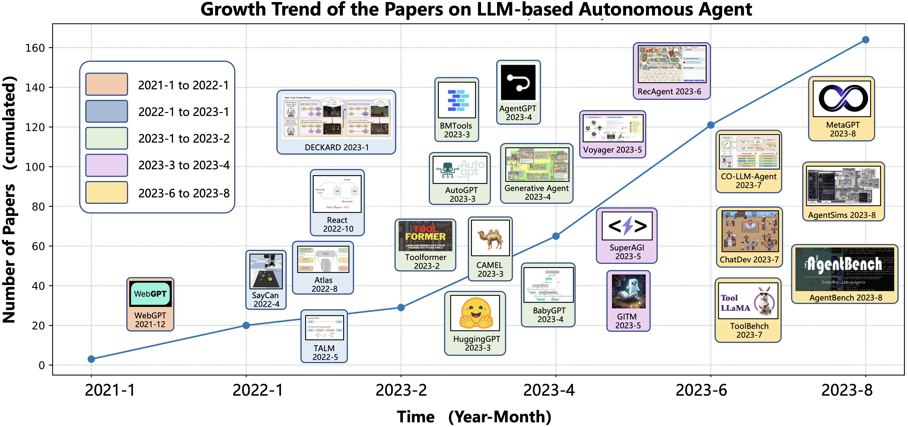

# A Survey on LLM-based Autonomous Agents

Autonomous artificial intelligence (AI) agents are designed to accomplish specific objectives by self-guided instructions, automatic memorization, planning, and action. With the advent and prospering of large language models (LLMs), there is an expanding frontier in using LLMs as core controllers for these autonomous entities. However, a unified view that ties together the diverse studies in this field has been lacking. This repository houses a comprehensive and systematic survey that fills this gap, focusing on LLM-based autonomous AI agents in their construction, applications, and evaluation strategies.

In particular, we explore the essential components of an AI agent, including a profile module, a memory module, a planning module, and an action module. We further investigate the potential applications in natural and social sciences and introduce methods to evaluate their effectiveness. Challenges and future directions of this field are also discussed.

Our paper and this repository aim to serve as a resource for researchers and practitioners alike, providing insights, related references, and continuous updates on this exciting and rapidly evolving field.


## [Interactive Table](https://abyssinian-molybdenum-f76.notion.site/8335774013284f2681d6418279f03634?v=681bd9466cd649d98c818040cdf52e17&pvs=4)


We are maintaining an interactive table that contains papers related to LLM-based Agents. This table includes details such as tags, authors, publication date, and more, allowing you to sort, filter, and find the papers of interest to you.

## News
- [8/23/2023] The first version of the paper is released on arXiv: [A Survey on LLM-based Autonomous AI Agents]()

## Timeline of LLM-based Autonomous Agent


## Agent Architecture Design


## Construction of LLM-based Autonomous Agent
<style>
td{
    border: 1px solid black;
    text-align: center;
    vertical-align: middle;
    padding: 5px;
}
</style>
<table>
    <tr>
        <td rowspan='2'>Model</td>
        <td rowspan='2'>Profile</td>
        <td colspan='2'>Memory</td>
        <td rowspan='2'>Planning</td>
        <td rowspan='2'>Action</td>
        <td rowspan='2'>LS</td>
        <td rowspan='2'>Time</td>        
        <td rowspan='2'>Paper</td>
        <td rowspan='2'>Code</td>
    </tr>
    <tr>
        <td>Operation</td>
        <td>Structure</td>
    </tr>
    <tr>
        <td>WebGPT: Browser-assisted question-answering with human feedback</td>
        <td>-</td> 
        <td>-</td> 
        <td>-</td> 
        <td>-</td> 
        <td>w/ tools</td> 
        <td>Human feedback</td> 
        <td>12/2021</td>
        <td><a href="https://arxiv.org/abs/2112.09332">Paper</a></td>
        <td>-</td>
    </tr>
    <tr>
        <td>Do As I Can, Not As I Say: Grounding Language in Robotic Affordances</td> 
        <td>-</td>  
        <td>-</td>  
        <td>-</td>  
        <td>w/o feedback</td> 
        <td>w/ tools</td> 
        <td>Environment feedback</td>  
        <td>04/2022</td> 
        <td><a href="https://arxiv.org/abs/2204.01691">Paper</a></td>
        <td><a href="https://say-can.github.io/">Code</a></td>
    </tr>
    <tr>
        <td>MRKL Systems: A modular, neuro-symbolic architecture that combines large language models, external knowledge sources and discrete reasoning</td> 
        <td>-</td>  
        <td>-</td>  
        <td>-</td>  
        <td>w/o feedback</td> 
        <td>w/ tools</td> 
        <td>-</td>  
        <td>05/2022</td> 
        <td><a href="https://arxiv.org/abs/2205.00445">Paper</a></td>
        <td>-</td>
    </tr>
    <tr>
        <td>Inner Monologue: Embodied Reasoning through Planning with Language Models</td> 
        <td>-</td>  
        <td>-</td>  
        <td>-</td>  
        <td>w/ feedback</td> 
        <td>w/ tools</td> 
        <td>Environment feedback</td> 
        <td>07/2022</td> 
        <td><a href="https://arxiv.org/abs/2207.05608">Paper</a></td>
        <td><a href="https://innermonologue.github.io/">Code</a></td>
    </tr>
    <tr>
        <td>Social Simulacra: Creating Populated Prototypes for Social Computing Systems</td>  
        <td>GPT-Generated</td> 
        <td>-</td>  
        <td>-</td>  
        <td>-</td>  
        <td>w/o tools</td> 
        <td>-</td>   
        <td>08/2022</td> 
        <td><a href="https://arxiv.org/abs/2208.04024">Paper</a></td>
        <td>-</td>
    </tr>
    <tr>
        <td>ReAct: Synergizing Reasoning and Acting in Language Models</td> 
        <td>-</td>  
        <td>-</td>  
        <td>-</td>  
        <td>w/ feedback</td> 
        <td>w/ tools</td> 
        <td>Environment feedback</td> 
        <td>10/2022</td> 
        <td><a href="https://arxiv.org/abs/2210.03629">Paper</a></td>
        <td><a href="https://github.com/ysymyth/ReAct">Code</a></td>
    </tr>
    <tr>
        <td>REPLUG: Retrieval-Augmented Black-Box Language Models</td> 
        <td>-</td>  
        <td>Read/Write/Reflection</td> 
        <td>Unified</td> 
        <td>-</td>  
        <td>w/o tools</td> 
        <td>-</td>  
        <td>01/2023</td> 
        <td><a href="https://arxiv.org/abs/2301.12652">Paper</a></td>
        <td>-</td>
    </tr>
    <tr>
        <td>Describe, Explain, Plan and Select: Interactive Planning with Large Language Models Enables Open-World Multi-Task Agents</td>  
        <td>-</td>  
        <td>-</td>  
        <td>-</td>  
        <td>w/ feedback</td> 
        <td>w/ tools</td> 
        <td>Environment feedback</td> 
        <td>02/2023</td> 
        <td><a href="https://arxiv.org/abs/2302.01560">Paper</a></td>
        <td>-</td>
    </tr>
    <tr>
        <td>Toolformer: Language Models Can Teach Themselves to Use Tools</td> 
        <td>-</td>  
        <td>-</td>  
        <td>-</td>  
        <td>w/o feedback</td> 
        <td>w/ tools</td> 
        <td>Example</td>  
        <td>02/2023</td> 
        <td><a href="https://arxiv.org/abs/2302.04761">Paper</a></td>
        <td><a href="https://github.com/lucidrains/toolformer-pytorch">Code</a></td>
    </tr>
    <tr>
        <td>Reflexion: Language Agents with Verbal Reinforcement Learning</td> 
        <td>-</td>  
        <td>Read/Write/Reflection</td> 
        <td>Hybrid</td> 
        <td>w/ feedback</td> 
        <td>w/o tools</td> 
        <td>Environment feedback</td> 
        <td>03/2023</td> 
        <td><a href="https://arxiv.org/abs/2303.11366">Paper</a></td>
        <td><a href="https://github.com/noahshinn024/reflexion">Code</a></td>
    </tr>
    <tr>
        <td>CAMEL: Communicative Agents for “Mind” Exploration of Large Scale Language Model Society 
        Handcrafting & GPT-Generated</td> 
        <td>Handcrafting & GPT-Generated</td> 
        <td>-</td>  
        <td>-</td>  
        <td>w/ feedback</td>  
        <td>w/o tools</td> 
        <td>-</td>  
        <td>03/2023</td> 
        <td><a href="https://arxiv.org/abs/2303.17660">Paper</a></td>
        <td><a href="https://github.com/camel-ai/camel">Code</a></td>
    </tr>
    <tr>
        <td>API-Bank: A Benchmark for Tool-Augmented LLMs</td> 
        <td>-</td>  
        <td>-</td>  
        <td>-</td>  
        <td>w/ feedback</td>  
        <td>w/ tools</td> 
        <td>Example</td> 
        <td>04/2023</td> 
        <td><a href="url">Paper</a></td>
        <td><a href="url">Code</a></td>
    </tr>
    <tr>
        <td>ViperGPT: Visual Inference via Python Execution for Reasoning</td> 
        <td>-</td>  
        <td>-</td>  
        <td>-</td>  
        <td>-</td>  
        <td>w/ tools</td>  
        <td>-</td>  
        <td>03/2023</td>  
        <td><a href="https://arxiv.org/abs/2303.08128">Paper</a></td>
        <td><a href="https://github.com/cvlab-columbia/viper">Code</a></td>
    </tr>
    <tr>
        <td>HuggingGPT: Solving AI Tasks with ChatGPT and itsFriends in Hugging Face</td> 
        <td>-</td>  
        <td>Read/Write</td> 
        <td>Unified</td> 
        <td>w/o feedback</td>  
        <td>w/ tools</td> 
        <td>-</td>  
        <td>03/2023</td> 
        <td><a href="https://arxiv.org/abs/2303.17580">Paper</a></td>
        <td><a href="https://huggingface.co/">Code</a></td>
    </tr>
    <tr>
        <td>Generative Agents: Interactive Simulacra of Human Behavior</td> 
        <td>Handcrafting</td> 
        <td>Read/Write/Reflection</td> 
        <td>Hybrid</td> 
        <td>w/o feedback</td> 
        <td>w/o tools</td>  
        <td>-</td>  
        <td>04/2023</td> 
        <td><a href="https://arxiv.org/abs/2304.03442">Paper</a></td>
        <td><a href="https://github.com/joonspk-research/generative_agents">Code</a></td>
    </tr>
    <tr>
        <td>LLM+P: Empowering Large Language Models with Optimal Planning Proficiency</td> 
        <td>-</td>  
        <td>-</td>  
        <td>-</td>  
        <td>w/o feedback</td> 
        <td>w/ tools</td> 
        <td>-</td>  
        <td>04/2023</td> 
        <td><a href="https://arxiv.org/abs/2304.11477">Paper</a></td>
        <td>-</td>
    </tr>
    <tr>
        <td>Augmenting large language models with chemistry tools</td>
        <td>-</td> 
        <td>-</td> 
        <td>-</td> 
        <td>w feedback</td>
        <td>w/ tools</td>
        <td>-</td> 
        <td>04/2023</td>
        <td><a href="https://arxiv.org/abs/2304.05376">Paper</a></td>
        <td><a href="https://github.com/ur-whitelab/chemcrow-public">Code</a></td>
    </tr>
    <tr>
        <td>OpenAGI: When LLM Meets Domain Experts</td>
        <td>-</td> 
        <td>-</td> 
        <td>-</td> 
        <td>w feedback</td>
        <td>w/ tools</td>
        <td>Example</td>
        <td>04/2023</td>
        <td>-</td>
        <td><a href="https://github.com/agiresearch/OpenAGI/blob/main/README.md">Code</a></td>
    </tr>
    <tr>
        <td>Auto-GPT: An Autonomous GPT-4 Experiment</td>
        <td>-</td> 
        <td>Read/Write</td>
        <td>Hybrid</td>
        <td>w feedback</td>
        <td>w tools</td>
        <td>Environment feedback</td> 
        <td>04/2023</td>
        <td>-</td>
        <td><a href="https://github.com/Significant-Gravitas/Auto-GPT">Code</a></td>
    </tr>
    <tr>
        <td>Unleashing Infinite-Length Input Capacity for Large-scale Language Models with Self-Controlled Memory System</td>
        <td>-</td> 
        <td>Read/Write</td>
        <td>Hybrid</td>
        <td>-</td> 
        <td>w/o tools</td>
        <td>-</td> 
        <td>04/2023</td>
        <td><a href="https://arxiv.org/abs/2304.13343">Paper</a></td>
        <td><a href="https://github.com/wbbeyourself/scm4llms">Code</a></td>
    </tr>
    <tr>
        <td>Training Socially Aligned Language Models in Simulated Human Society</td>
        <td>-</td> 
        <td>Read/Write</td>
        <td>Hybrid</td>
        <td>-</td> 
        <td>w/o tools</td>
        <td>Example</td>
        <td>05/2023</td>
        <td><a href="https://arxiv.org/abs/2305.16960">Paper</a></td>
        <td><a href="https://github.com/agi-templar/Stable-Alignment">Code</a></td>
    </tr>
    <tr>
        <td>Ghost in the Minecraft: Generally Capable Agents for Open-World Enviroments via Large Language Models with Text-based Knowledge and Memory</td>
        <td>-</td> 
        <td>Read/Write/Reflection</td>
        <td>Hybrid</td>
        <td>w/ feedback</td> 
        <td>w/o tools</td>
        <td>Environment feedback</td>
        <td>05/2023</td>
        <td><a href="https://arxiv.org/abs/2305.17144">Paper</a></td>
        <td><a href="https://github.com/OpenGVLab/GITM">Code</a></td>
    </tr>
    <tr>
        <td>VOYAGER: An Open-Ended Embodied Agentwith Large Language Models</td>
        <td>-</td> 
        <td>Read/Write/Reflection</td>
        <td>Unified</td>
        <td>w/ feedback</td> 
        <td>w/o tools</td>
        <td>Environment feedback</td>
        <td>05/2023</td>
        <td><a href="https://arxiv.org/abs/2305.16291">Paper</a></td>
        <td><a href="https://github.com/MineDojo/Voyager">Code</a></td>
    </tr>
    <tr>
        <td>Introspective Tips: Large Language Model for In-Context Decision Making</td>
        <td>-</td> 
        <td>Read/Write/Reflection</td>
        <td>Unified</td>
        <td>w/ feedback</td>
        <td>w/o tools</td>
        <td>Example & Environment feedback</td>
        <td>05/2023</td>
        <td><a href="https://arxiv.org/abs/2305.11598">Paper</a></td>
        <td>-</td>
    </tr>
    <tr>
        <td>RET-LLM: Towards a General Read-Write Memory for Large Language Models</td>
        <td>-</td> 
        <td>Read/Write/Reflection</td>
        <td>Unified</td>
        <td>-</td> 
        <td>w/o tools</td>
        <td>Example</td>
        <td>05/2023</td>
        <td><a href="https://arxiv.org/abs/2305.14322">Paper</a></td>
        <td>-</td>
    </tr>
    <tr>
        <td>ChatDB: Augmenting LLMs with Databases as Their Symbolic Memory</td>
        <td>-</td> 
        <td>Read/Write/Reflection</td> 
        <td>Unified</td> 
        <td>w/ feedback</td>
        <td>w/ tools</td> 
        <td>-</td> 
        <td>06/2023</td>
        <td><a href="https://arxiv.org/abs/2306.03901">Paper</a></td>
        <td>-</td>
    </tr>
    <tr>
        <td> $\mathbf{s^3}$: Social-network Simulation System with Large Language Model-Empowered Agents</td> 
        <td>Dataset alignment</td>
        <td>Read/Write/Reflection</td>
        <td>Hybrid</td> 
        <td>w/o feedback</td> 
        <td>w/o tools</td>
        <td>-</td> 
        <td>07/2023</td>
        <td><a href="https://arxiv.org/abs/2307.14984">Paper</a></td>
        <td>-</td>
    </tr>
    <tr>
        <td>Communicative Agents for Software Development</td>
        <td>Handcrafting</td>
        <td>Read/Write/Reflection</td>
        <td>Unified</td>
        <td>w/ feedback</td>
        <td>w/o tools</td>
        <td>-</td> 
        <td>07/2023</td>
        <td><a href="https://arxiv.org/abs/2307.07924">Paper</a></td>
        <td><a href="url">Code</a></td>
    </tr>
    <tr>
        <td>ToolLLM: Facilitating Large Language Models to Master 16000+ Real-world APIs</td>
        <td>-</td> 
        <td>-</td> 
        <td>-</td> 
        <td>w/ feedback</td> 
        <td>w/ tools</td>
        <td>Example</td>
        <td>07/2023</td>
        <td><a href="https://arxiv.org/abs/2307.16789">Paper</a></td>
        <td><a href="https://github.com/OpenBMB/ToolBench">Code</a></td>
    </tr>
    <tr>
        <td>MemoryBank: Enhancing Large Language Models with Long-Term Memory</td> 
        <td>-</td> 
        <td>Read/Write/Reflection</td>
        <td>Hybrid</td>
        <td>-</td> 
        <td>w/o tools</td>
        <td>-</td> 
        <td>07/2023</td>
        <td><a href="https://arxiv.org/abs/2305.10250">Paper</a></td>
        <td><a href="https://github.com/zhongwanjun/MemoryBank-SiliconFriend">Code</a></td>
    </tr>
    <tr>
        <td>MetaGPT: Meta Programming for Multi-Agent Collaborative Framework</td>
        <td>Handcrafting</td>
        <td>Read/Write/Reflection</td>
        <td>Hybrid</td>
        <td>w/ feedback</td>
        <td>w/ tools</td>
        <td>-</td>  
        <td>08/2023</td> 
        <td><a href="https://arxiv.org/abs/2308.00352">Paper</a></td>
        <td><a href="https://github.com/geekan/MetaGPT">Code</a></td>
    </tr>
</table>

## Application and Evaluation


## Applications of LLM-based Autonomous Agent

### Social Science

#### Psychology
- Using large language models to simulate multiple humans and replicate human subject studies [[Paper](https://arxiv.org/abs/2208.10264)]
- [akata2023playing]
- [ziems2023can]

#### Political Science and Economy
- [argyle2023out]
- [horton2023large]
- [ziems2023can]

#### Social Simulation
- [park2022social]
- [park2023generative]
- [kovavc2023socialai]
- [lin2023agentsims]
- [gao2023s]
- [williams2023epidemic]
- [li2023you]
- [li2023quantifying]

#### Jurisprudence
- [cui2023chatlaw]
- [huenabling]

#### Research Assistant
- [ziems2023can]
- [bail2023can]

### Natural Science

#### Documentation, Data Managent
- [bran2023chemcrow]
- [boiko2023emergent]
- [kang2023chatmof]

#### Experiment Assistant
- [bran2023chemcrow]
- [boiko2023emergent]

#### Science Education
- [boiko2023emergent]
- [swan2023math]
- [Drori_2022]
- [chen2021evaluating]

### Engineering

#### Civil Engineering
- [mehta2023improving]

#### CS & SE
- [qin2023toolllm]
- [qian2023communicative]
- [hong2023metagpt]
- [dong2023self]
- [GPTEngineer]
- [SmolModels]
- [DemoGPT]

#### Aerospace Engineering
- [ogundare2023industrial]

#### Industrial Automation
- [xia2023towards]

#### Robotics & Embodied AI
- [dasgupta2023collaborating]
- [zhou2023dialogue]
- [nottingham2023embodied]
- [wu2023embodied]
- [wang2023voyager]
- [zhu2023ghost]
- [huenabling]
- [wu2023plan]
- [zhang2023large]
- [di2023towards]
- [ahn2022can]

#### General Autonomous Agents
- [Auto-gpt]
- [Agentgpt]
- [AI-legion]
- [AGiXT]
- [AgentVerse]
- [XLang]
- [BabyAGI]
- [langchain]
- [workgpt]
- [loopgpt]
- [gpt-researcher]
- [qin2023bmtools]
- [transformers-agent]
- [DemoGPT]
- [MiniAGI]
- [SuperAGI]
- [wu2023autogen]
## Evaluation on LLM-based Autonomous Agent
<table border='1'>
    <tr>
        <td>Model</td>
        <td>Subjective </td>
        <td>Objective </td>
        <td>Benchmark</td>
        <td>Time</td>
        <td>Paper</td>
        <td>Code</td>
    </tr>
    <tr>
        <td>WebShop: Towards Scalable Real-World Web Interaction with Grounded Language Agents</td>
        <td>-</td>
        <td>Environment Simluation;<br> Isolated Reasoning;<br> Multi-task Evaluation </td>
        <td>&check;</td>
        <td>07/2022</td>
        <td><a href="https://arxiv.org/abs/2207.01206">Paper</a></td>
        <td><a href="https://github.com/princeton-nlp/webshop">Code</a></td>
    </tr>
    <tr>
        <td>Social Simulacra: Creating Populated Prototypes for Social Computing Systems </td>
        <td>Human Annotation</td>
        <td>Social Evaluation</td>
        <td>-</td>
        <td>08/2022</td>
        <td><a href="https://arxiv.org/abs/2208.04024">Paper</a></td>
        <td>-</td>
    </tr>
    <tr>
        <td>Using Large Language Models to Simulate Multiple Humans and Replicate Human Subject Studies</td>
        <td>-</td>
        <td>Social Evaluation</td>
        <td>-</td>
        <td>08/2022</td>
        <td><a href="https://arxiv.org/abs/2208.10264">Paper</a></td>
        <td><a href="https://github.com/GatiAher/UsingLarge-Language-Models-to-Replicate-Human-Subject-Studies">Code</a></td>
    </tr>
    <tr>
        <td>Large Language Models are Few-Shot Testers: Exploring LLM-based General Bug Reproduction</td>
        <td>-</td>
        <td>Software Testing</td>
        <td>-</td>
        <td>09/2022</td>
        <td><a href="https://arxiv.org/abs/2209.11515">Paper</a></td>
        <td>-</td>
    </tr>
    <tr>
        <td>ReAct: Synergizing Reasoning and Acting in Language Models</td>
        <td>-</td>
        <td>Environment Simluation</td>
        <td>&check;</td>
        <td>10/2022</td>
        <td><a href="https://arxiv.org/abs/2210.03629">Paper</a></td>
        <td><a href="https://github.com/ysymyth/ReAct">Code</a></td>
    </tr>
    <tr>
        <td>Out of One, Many: Using Language Models to Simulate Human Samples</td>
        <td>Turing Test</td>
        <td> Isolated Reasoning;<br> Multi-task Evaluation</td>
        <td>-</td>
        <td>02/2023</td>        
        <td><a href="https://arxiv.org/abs/2209.06899">Paper</a></td>
        <td>-</td>
    </tr>
    <tr>
        <td>Describe, Explain, Plan and Select: Interactive Planning with Large Language Models Enables Open-World Multi-Task Agents </td>
        <td>-</td>
        <td>Environment Simluation</td>
        <td>&check;</td>
        <td>02/2023</td>
        <td><a href="https://arxiv.org/abs/2302.01560">Paper</a></td>
        <td>-</td>
    </tr>
    <tr>
        <td>ChatGPT and Software Testing Education: Promises & Perils</td>
        <td>-</td>
        <td>Software Testing</td>
        <td>-</td>
        <td>02/2023</td>
        <td><a href="https://arxiv.org/abs/2302.03287">Paper</a></td>
        <td><a href="https://github.com/sajedjalil/ChatGPT-Software-Testing-Stud">Code</a></td>
    </tr>
    <tr>
        <td>Reflexion: Language Agents with Verbal Reinforcement Learning</td>
        <td>-</td>
        <td>Isolated Reasoning</td>
        <td>-</td>
        <td>03/2023</td>
        <td><a href="https://arxiv.org/abs/2303.11366">Paper</a></td>
        <td><a href="https://github.com/noahshinn024/reflexion">Code</a></td>
    </tr>
    <tr>
        <td>Improving Grounded Language Understanding in a Collaborative Environment by Interacting with Agents Through Help Feedback </td>
        <td>-</td>
        <td>Environment Simluation</td>
        <td>&check;</td>
        <td>04/2023</td>
        <td><a href="https://arxiv.org/abs/2304.10750">Paper</a></td>
        <td>-</td>
    </tr>
    <tr>
        <td>LLM+P: Empowering Large Language Models with Optimal Planning Proficiency</td>
        <td>-</td>
        <td>Isolated Reasoning</td>
        <td>-</td>
        <td>04/2023</td>
        <td><a href="https://arxiv.org/abs/2304.11477">Paper</a></td>
        <td>-</td>
    </tr>
    <tr>
        <td>Generative Agents: Interactive Simulacra of Human Behavior</td>
        <td> Human Annoation;<br>Turing Test</td>
        <td>-</td>
        <td>-</td>
        <td>04/2023</td>
        <td><a href="https://arxiv.org/abs/2304.03442">Paper</a></td>
        <td><a href="https://github.com/joonspk-research/generative_agents">Code</a></td>
    </tr>
    <tr>
        <td>ToolLLM: Facilitating Large Language Models to Master 16000+ Real-world APIs</td>
        <td>Human Annoation</td>
        <td>Multi-task Evalution</td>
        <td>&check;</td>
        <td>04/2023</td>
        <td><a href="https://arxiv.org/abs/2307.16789">Paper</a></td>
        <td><a href="https://github.com/OpenBMB/ToolBench">Code</a></td>
    </tr>
    <tr>
        <td>Ghost in the Minecraft: Generally Capable Agents for Open-World Enviroments via Large Language Models with Text-based Knowledge and Memory</td>
        <td>-</td>
        <td>Environment simulation</td>
        <td>&check;</td>
        <td>05/2023</td>
        <td><a href="https://arxiv.org/abs/2305.17144">Paper</a></td>
        <td><a href="https://github.com/OpenGVLab/GITM">Code</a></td>
    </tr>
    <tr>
        <td>Two Failures of Self-Consistency in the Multi-Step Reasoning of LLMs </td>
        <td>-</td>
        <td>Environment Simulation</td>
        <td>-</td>
        <td>05/2023</td>
        <td><a href="https://arxiv.org/abs/2305.14279">Paper</a></td>
        <td>-</td>
    </tr>
    <tr>
        <td>VOYAGER: An Open-Ended Embodied Agentwith Large Language Models</td>
        <td>-</td>
        <td>Environment Simulation</td>
        <td>&check;</td>
        <td>05/2023</td>
        <td><a href="https://arxiv.org/abs/2305.16291">Paper</a></td>
        <td><a href="https://github.com/MineDojo/Voyager">Code</a></td>
    </tr>
    <tr>
        <td>Do LLMs Understand Social Knowledge? Evaluating the Sociability of Large Language Models with SOCKET Benchmark </td>
        <td>-</td>
        <td>Isolated Reasoning;<br> Social Evaluation;<br>Multi-task Evaluation </td>
        <td>&check;</td>
        <td>05/2023</td>
        <td><a href="https://arxiv.org/abs/2305.14938">Paper</a></td>
        <td>-</td>
    </tr>
    <tr>
        <td>Mobile-Env: An Evaluation Platform and Benchmark for Interactive Agents in LLM Era</td>
        <td>-</td>
        <td>Environment Simluation;<br> Isolated Reasoning;<br> Multi-task Evaluation</td>
        <td>&check;</td>
        <td>05/2023</td>
        <td><a href="https://arxiv.org/abs/2305.08144">Paper</a></td>
        <td><a href="https://github.com/X-LANCE/Mobile-Env">Code</a></td>
    </tr>
    <tr>
        <td>Clembench: Using Game Play to Evaluate Chat-Optimized Language Models as Conversational Agents</td>
        <td>-</td>
        <td>Environment Simluation</td>
        <td>&check;</td>
        <td>05/2023</td>
        <td><a href="https://arxiv.org/abs/2305.13455">Paper</a></td>
        <td><a href="https://github.com/clp-research/clembench">Code</a></td>
    </tr>
    <tr>
        <td>Decision-Oriented Dialogue for Human–AI Collaboration</td>
        <td>-</td>
        <td>Social Evaluation</td>
        <td>&check;</td>
        <td>06/2023</td>
        <td><a href="https://arxiv.org/abs/2305.20076">Paper</a></td>
        <td><a href="https://github.com/jlin816/dialop">Code</a></td>
    </tr>
    <tr>
        <td>ChatDB: Augmenting LLMs with Databases as Their Symbolic Memory</td>
        <td>-</td>
        <td>Isolated Reasoning</td>
        <td>-</td>
        <td>06/2023</td>
        <td><a href="https://arxiv.org/abs/2306.03901">Paper</a></td>
        <td>-</td>
    </tr>
    <tr>
        <td>Towards Autonomous Testing Agents via Conversational Large Language Models</td>
        <td>-</td>
        <td>Software Testing</td>
        <td>-</td>
        <td>06/2023</td>
        <td><a href="https://arxiv.org/abs/2306.05152">Paper</a></td>
        <td>-</td>
    </tr>
    <tr>
        <td>Building Cooperative Embodied Agents Modularly with Large Language Models</td>
        <td>Human Annoation</td>
        <td>Environment Simulation</td>
        <td>-</td>
        <td>07/2023</td>
        <td><a href="https://arxiv.org/abs/2307.02485">Paper</a></td>
        <td><a href="https://vis-www.cs.umass.edu/Co-LLM-Agents/">Code</a></td>
    </tr>
    <tr>
        <td>Tachikuma: Understading Complex Interactions with Multi-Character and Novel Objects by Large Language Models</td>
        <td>Human Annoation</td>
        <td>Environment Simluation</td>
        <td>&check;</td>
        <td>07/2023</td>
        <td><a href="https://arxiv.org/abs/2307.12573">Paper</a></td>
        <td>-</td>
    </tr>
    <tr>
        <td>Communicative Agents for Software Development</td>
        <td>-</td>
        <td>Isolated Reasoning</td>
        <td>-</td>
        <td>07/2023</td>
        <td><a href="https://arxiv.org/abs/2307.07924">Paper</a></td>
        <td>-</td>
    </tr>
    <tr>
        <td>WebArena: A Realistic Web Environment for Building Autonomous Agents</td>
        <td>-</td>
        <td>Environment Simluation</td>
        <td>&check;</td>
        <td>07/2023</td>
        <td><a href="https://arxiv.org/abs/2307.13854">Paper</a></td>
        <td><a href="https://github.com/web-arena-x/webarena">Code</a></td>
    </tr>
    <tr>
        <td>AgentSims: An Open-Source Sandbox for Large Language Model Evaluation</td>
        <td>-</td>
        <td>Social Evaluation</td>
        <td>-</td>
        <td>08/2023</td>
        <td><a href="https://arxiv.org/abs/2308.04026">Paper</a></td>
        <td><a href="https://github.com/py499372727/AgentSims">Code</a></td>
    </tr>
    <tr>
        <td>AgentBench: Evaluating LLMs as Agents</td>
        <td>-</td>
        <td>Multi-task Evaluation</td>
        <td>&check;</td>
        <td>08/2023</td>
        <td><a href="https://arxiv.org/abs/2308.03688">Paper</a></td>
        <td><a href="https://github.com/thudm/agentbench">Code</a></td>
    </tr>
    <tr>
        <td>BOLAA: Benchmarking and Orchestrating LLM-augmented Autonomous Agents</td>
        <td>-</td>
        <td>Environment Simulation;<br>Multi-task Evaluation;<br>Software Testing</td>
        <td>&check;</td>
        <td>08/2023</td>
        <td><a href="https://arxiv.org/abs/2308.05960">Paper</a></td>
        <td><a href="https://github.com/salesforce/BOLAA">Code</a></td>
    </tr>
    <tr>
        <td>Gentopia: A Collaborative Platform for Tool-Augmented LLMs</td>
        <td>-</td>
        <td>Isolated Reasoning;<br> Multi-task Evaluation </td>
        <td>&check;</td>
        <td>08/2023</td>
        <td><a href="https://arxiv.org/abs/2308.04030">Paper</a></td>
        <td><a href="https://github.com/Gentopia-AI/Gentopia">Code</a></td>
    </tr>
</table>


## Contributors
- Lei Wang@[Paitesanshi](https://github.com/Paitesanshi)
- Xueyang Feng@[XueyangFeng](https://github.com/XueyangFeng)
- Chen Ma@[Uily](https://github.com/Yilu114)

## Citation
If you find this survey useful, please cite our paper:
```
@article{wang2023survey,
  title={A Survey on LLM-based Autonomous AI Agents},
  author={Wang, Lei and Feng, Xueyang and Ma, Chen and others},
  journal={arXiv preprint arXiv:2108.10356},
  year={2021}
}
```
## How to Contribute
We warmly welcome contributions to this survey and interactive table. If you have a paper or know of relevant research that should be included, please contribute through pull requests, issues, email, or other methods.

## Contact Us
If you have any questions or suggestions, please contact us via:
- Email: wanglei154@ruc.edu.cn


