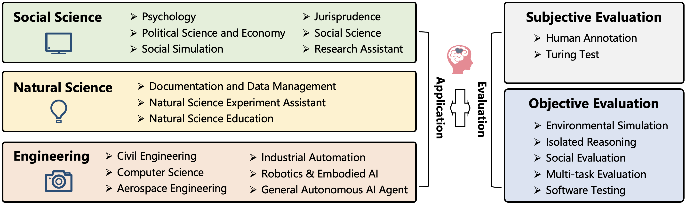

# A Survey on LLM-based Autonomous Agents

Autonomous artificial intelligence (AI) agents are designed to accomplish specific objectives by self-guided instructions, automatic memorization, planning, and action. With the advent and prospering of large language models (LLMs), there is an expanding frontier in using LLMs as core controllers for these autonomous entities. However, a unified view that ties together the diverse studies in this field has been lacking. This repository houses a comprehensive and systematic survey that fills this gap, focusing on LLM-based autonomous AI agents in their construction, applications, and evaluation strategies.

In particular, we explore the essential components of an AI agent, including a profile module, a memory module, a planning module, and an action module. We further investigate the potential applications in natural and social sciences and introduce methods to evaluate their effectiveness. Challenges and future directions of this field are also discussed.

Our paper and this repository aim to serve as a resource for researchers and practitioners alike, providing insights, related references, and continuous updates on this exciting and rapidly evolving field.


## [Interactive Table](https://abyssinian-molybdenum-f76.notion.site/8335774013284f2681d6418279f03634?v=681bd9466cd649d98c818040cdf52e17&pvs=4)


We are maintaining an interactive table that contains papers related to LLM-based Agents. This table includes details such as tags, authors, publication date, and more, allowing you to sort, filter, and find the papers of interest to you.

## News
- [8/23/2023] The first version of the paper is released on arXiv: [A Survey on LLM-based Autonomous AI Agents]()

## Timeline of LLM-based Autonomous Agent


## Agent Architecture Design


## Construction of LLM-based Autonomous Agent
<style>
td{
    border: 1px solid black;
    text-align: center;
    vertical-align: middle;
    padding: 5px;
}
</style>
<table>
    <tr>
        <td rowspan='2'>Model</td>
        <td rowspan='2'>Profile</td>
        <td colspan='2'>Memory</td>
        <td rowspan='2'>Planning</td>
        <td rowspan='2'>Action</td>
        <td rowspan='2'>LS</td>
        <td rowspan='2'>Time</td>
    </tr>
    <tr>
        <td>Operation</td>
        <td>Structure</td>
    </tr>
    <tr>
        <td>WebGPT\cite{nakano2021webgpt}</td>
        <td>-</td>
        <td>-</td>
        <td>-</td>
        <td>\whitecircle{2}</td>
        <td>\whitecircle{2}</td>
        <td>\whitecircle{2}</td>
        <td>12/2021</td>
    </tr>
    <tr>
        <td>SayCan\cite{ahn2022can}</td>
        <td>-</td>
        <td>-</td>
        <td>-</td>
        <td>\whitecircle{2}</td>
        <td>\whitecircle{2}</td>
        <td>\whitecircle{3}</td>
        <td>04/2022</td>
    </tr>
    <tr>
        <td>MRKL\cite{karpas2022mrkl}</td>
        <td>-</td>
        <td>-</td>
        <td>-</td>
        <td>\whitecircle{1}</td>
        <td>\whitecircle{2}</td>
        <td>-</td>
        <td>05/2022</td>
    </tr>
    <tr>
        <td>%Translated LLM~\cite{huang2022language}</td>
        <td>-</td>
        <td>-</td>
        <td>-</td>
        <td>\whitecircle{2}</td>
        <td>-</td>
        <td>-</td>
        <td>07/2022</td>
    </tr>
    <tr>
        <td>% Inner Monologue\cite{huang2022inner}</td>
        <td>-</td>
        <td>-</td>
        <td>-</td>
        <td>\whitecircle{2}</td>
        <td>\whitecircle{2}</td>
        <td>\whitecircle{3}</td>
        <td>07/2022</td>
    </tr>
    <tr>
        <td>Social Simulacra\cite{park2022social}</td>
        <td>\whitecircle{2}</td>
        <td>-</td>
        <td>-</td>
        <td>-</td>
        <td>\whitecircle{1}</td>
        <td>-</td>
        <td>08/2022</td>
    </tr>
    <tr>
        <td>% Silicon Samples\cite{argyle2023out}</td>
        <td>\whitecircle{3}</td>
        <td>-</td>
        <td>-</td>
        <td>-</td>
        <td>\whitecircle{2}</td>
        <td>-</td>
        <td>09/2022</td>
    </tr>
    <tr>
        <td>ReAct\cite{yao2022react}</td>
        <td>-</td>
        <td>-</td>
        <td>-</td>
        <td>\whitecircle{2}</td>
        <td>\whitecircle{2}</td>
        <td>\whitecircle{3}</td>
        <td>10/2022</td>
    </tr>
    <tr>
        <td>Replug\cite{shi2023replug}</td>
        <td>-</td>
        <td>\whitecircle{1}</td>
        <td>\whitecircle{1}</td>
        <td>\whitecircle{2}</td>
        <td>\whitecircle{1}</td>
        <td>-</td>
        <td>01/2023</td>
    </tr>
    <tr>
        <td>MALLM\cite{schuurmans2023memory}</td>
        <td>\-</td>
        <td>\whitecircle{1}</td>
        <td>\whitecircle{1}</td>
        <td>-</td>
        <td>\whitecircle{1}</td>
        <td>-</td>
        <td>01/2023</td>
    </tr>
    <tr>
        <td>DEPS\cite{wang2023describe}</td>
        <td>-</td>
        <td>-</td>
        <td>-</td>
        <td>\whitecircle{2}</td>
        <td>\whitecircle{1}</td>
        <td>\whitecircle{3}</td>
        <td>02/2023</td>
    </tr>
    <tr>
        <td>Toolformer\cite{schick2023toolformer}</td>
        <td>-</td>
        <td>-</td>
        <td>-</td>
        <td>\whitecircle{1}</td>
        <td>\whitecircle{1}</td>
        <td>-</td>
        <td>02/2023</td>
    </tr>
    <tr>
        <td>Reflexion\cite{shinn2023reflexion}</td>
        <td>-</td>
        <td>\whitecircle{2}</td>
        <td>\whitecircle{2}</td>
        <td>\whitecircle{2}</td>
        <td>\whitecircle{1}</td>
        <td>\whitecircle{3}</td>
        <td>03/2023</td>
    </tr>
    <tr>
        <td>%Self-Refine\cite{madaan2023self}</td>
        <td>-</td>
        <td>-</td>
        <td>-</td>
        <td>\whitecircle{2}</td>
        <td>\whitecircle{1}</td>
        <td>?</td>
        <td>03/2023</td>
    </tr>
    <tr>
        <td>DERA\cite{nair2023dera}</td>
        <td>\whitecircle{1}</td>
        <td>\whitecircle{2}</td>
        <td>\whitecircle{2}</td>
        <td>\whitecircle{2}</td>
        <td>\whitecircle{1}</td>
        <td>\whitecircle{2}</td>
        <td>03/2023</td>
    </tr>
    <tr>
        <td>%Colt5\cite{ainslie2023colt5}</td>
        <td>-</td>
        <td>\whitecircle{2}</td>
        <td>\whitecircle{2}</td>
        <td>-</td>
        <td>\whitecircle{1}</td>
        <td>-</td>
        <td>03/2023</td>
    </tr>
    <tr>
        <td>DERA\cite{nair2023dera}</td>
        <td>\whitecircle{2}</td>
        <td>-</td>
        <td>-</td>
        <td>\whitecircle{2}</td>
        <td>\whitecircle{1}</td>
        <td>-</td>
        <td>03/2023</td>
    </tr>
    <tr>
        <td>Camel\cite{li2023camel}</td>
        <td>\whitecircle{1} \whitecircle{2}</td>
        <td>\whitecircle{1}</td>
        <td>\whitecircle{1}</td>
        <td>\whitecircle{2}</td>
        <td>\whitecircle{1}</td>
        <td>-</td>
        <td>03/2023</td>
    </tr>
    <tr>
        <td>API-Bank\cite{li2023api}</td>
        <td>-</td>
        <td>-</td>
        <td>-</td>
        <td>\whitecircle{2}</td>
        <td>\whitecircle{2}</td>
        <td>\whitecircle{1}</td>
        <td>04/2023</td>
    </tr>
    <tr>
        <td>ViperGPT\cite{suris2023vipergpt}</td>
        <td>-</td>
        <td>\whitecircle{2}</td>
        <td>-</td>
        <td>-</td>
        <td>\whitecircle{2}</td>
        <td>-</td>
        <td>03/2023</td>
    </tr>
    <tr>
        <td>HuggingGPT\cite{shen2023hugginggpt}</td>
        <td>-</td>
        <td>\whitecircle{1}</td>
        <td>\whitecircle{1}</td>
        <td>\whitecircle{2}</td>
        <td>\whitecircle{2}</td>
        <td>-</td>
        <td>03/2023</td>
    </tr>
    <tr>
        <td>Generative Agents\cite{park2023generative}</td>
        <td>\whitecircle{1}</td>
        <td>\whitecircle{2}</td>
        <td>\whitecircle{2}</td>
        <td>\whitecircle{1}</td>
        <td>\whitecircle{1}</td>
        <td>-</td>
        <td>04/2023</td>
    </tr>
    <tr>
        <td>LLM+P\cite{liu2023llmp}</td>
        <td>-</td>
        <td>-</td>
        <td>-</td>
        <td>\whitecircle{1}</td>
        <td>\whitecircle{2}</td>
        <td>-</td>
        <td>04/2023</td>
    </tr>
    <tr>
        <td>ChemCrow\cite{bran2023chemcrow}</td>
        <td>-</td>
        <td>\whitecircle{1}</td>
        <td>\whitecircle{1}</td>
        <td>\whitecircle{1}</td>
        <td>\whitecircle{2}</td>
        <td>-</td>
        <td>04/2023</td>
    </tr>
    <tr>
        <td>%Refiner\cite{paul2023refiner}</td>
        <td>-</td>
        <td>-</td>
        <td>-</td>
        <td>\whitecircle{2}</td>
        <td>\whitecircle{2}</td>
        <td>?</td>
        <td>04/2023</td>
    </tr>
    <tr>
        <td>OpenAGI\cite{ge2023openagi}</td>
        <td>-</td>
        <td>-</td>
        <td>-</td>
        <td>\whitecircle{2}</td>
        <td>\whitecircle{2}</td>
        <td>\whitecircle{2}\whitecircle{3}</td>
        <td>04/2023</td>
    </tr>
    <tr>
        <td>AutoGPT\cite{Auto-gpt}</td>
        <td>-</td>
        <td>\whitecircle{1}</td>
        <td>\whitecircle{2}</td>
        <td>\whitecircle{2}</td>
        <td>\whitecircle{2}</td>
        <td>-</td>
        <td>04/2023</td>
    </tr>
    <tr>
        <td>SCM\cite{liang2023unleashing}</td>
        <td>-</td>
        <td>\whitecircle{2}</td>
        <td>\whitecircle{2}</td>
        <td>-</td>
        <td>\whitecircle{1}</td>
        <td>-</td>
        <td>04/2023</td>
    </tr>
    <tr>
        <td>SayCan\cite{ahn2022can}</td>
        <td>-</td>
        <td>\whitecircle{2}</td>
        <td>\whitecircle{2}</td>
        <td>\whitecircle{2}</td>
        <td>\whitecircle{1}</td>
        <td>\whitecircle{1}</td>
        <td>04/2023</td>
    </tr>
    <tr>
        <td>% IGLU\cite{mehta2023improving}</td>
        <td>-</td>
        <td>-</td>
        <td>-</td>
        <td>\whitecircle{2}</td>
        <td>\whitecircle{1}</td>
        <td>\whitecircle{2}</td>
        <td>04/2023</td>
    </tr>
    <tr>
        <td>ChatLog\cite{tu2023chatlog}</td>
        <td>\-</td>
        <td>\whitecircle{1}</td>
        <td>\whitecircle{1}</td>
        <td>\whitecircle{1}</td>
        <td>\whitecircle{1}</td>
        <td>\whitecircle{1}</td>
        <td>04/2023</td>
    </tr>
    <tr>
        <td>SANDBOX\cite{liu2023training}</td>
        <td>\whitecircle{1}</td>
        <td>\whitecircle{1}</td>
        <td>\whitecircle{2}</td>
        <td>\whitecircle{1}</td>
        <td>\whitecircle{1}</td>
        <td>-</td>
        <td>05/2023</td>
    </tr>
    <tr>
        <td>GITM\cite{zhu2023ghost}</td>
        <td>-</td>
        <td>\whitecircle{1}</td>
        <td>\whitecircle{2}</td>
        <td>\whitecircle{2}</td>
        <td>\whitecircle{1}</td>
        <td>\whitecircle{3}</td>
        <td>05/2023</td>
    </tr>
    <tr>
        <td>Voyager\cite{wang2023voyager}</td>
        <td>-</td>
        <td>\whitecircle{2}</td>
        <td>\whitecircle{2}</td>
        <td>\whitecircle{2}</td>
        <td>\whitecircle{1}</td>
        <td>\whitecircle{3}</td>
        <td>05/2023</td>
    </tr>
    <tr>
        <td>% Introspective Tips\cite{chen2023introspective}</td>
        <td>-</td>
        <td>\whitecircle{2}</td>
        <td>\whitecircle{2}</td>
        <td>\whitecircle{2}</td>
        <td>\whitecircle{1}</td>
        <td>\whitecircle{1}\whitecircle{2}</td>
        <td>05/2023</td>
    </tr>
    <tr>
        <td>% Gorilla\cite{patil2023gorilla}</td>
        <td>-</td>
        <td>-</td>
        <td>-</td>
        <td>\whitecircle{2}</td>
        <td>\whitecircle{2}</td>
        <td>-</td>
        <td>05/2023</td>
    </tr>
    <tr>
        <td>RET-LLM\cite{modarressi2023ret}</td>
        <td>-</td>
        <td>\whitecircle{2}</td>
        <td>\whitecircle{1}</td>
        <td>-</td>
        <td>\whitecircle{1}</td>
        <td>-</td>
        <td>05/2023</td>
    </tr>
    <tr>
        <td>% Self-Notes\cite{lanchantin2023learning}</td>
        <td>-</td>
        <td>\whitecircle{2}</td>
        <td>\whitecircle{2}</td>
        <td>-</td>
        <td>\whitecircle{1}</td>
        <td>-</td>
        <td>05/2023</td>
    </tr>
    <tr>
        <td>SocialAGI\cite{fischer2023reflective}</td>
        <td>\whitecircle{2}</td>
        <td>\whitecircle{2}</td>
        <td>\whitecircle{2}</td>
        <td>\whitecircle{2}</td>
        <td>\whitecircle{2}</td>
        <td>\whitecircle{2}</td>
        <td>05/2023</td>
    </tr>
    <tr>
        <td>ChatDB\cite{hu2023chatdb}</td>
        <td>-</td>
        <td>\whitecircle{2}</td>
        <td>\whitecircle{1}</td>
        <td>\whitecircle{2}</td>
        <td>\whitecircle{2}</td>
        <td>-</td>
        <td>06/2023</td>
    </tr>
    <tr>
        <td>% $\mathbf{s^3}$\cite{gao2023s}</td>
        <td>\whitecircle{3}</td>
        <td>\whitecircle{2}</td>
        <td>\whitecircle{2}</td>
        <td>\whitecircle{1}</td>
        <td>\whitecircle{1}</td>
        <td>-</td>
        <td>07/2023</td>
    </tr>
    <tr>
        <td>ChatDev\cite{qian2023communicative}</td>
        <td>\whitecircle{1}</td>
        <td>\whitecircle{2}</td>
        <td>\whitecircle{1}</td>
        <td>\whitecircle{2}</td>
        <td>\whitecircle{1}</td>
        <td>-</td>
        <td>07/2023</td>
    </tr>
    <tr>
        <td>ToolLLM\cite{qin2023toolllm}</td>
        <td>-</td>
        <td>-</td>
        <td>-</td>
        <td>\whitecircle{2}</td>
        <td>\whitecircle{2}</td>
        <td>-</td>
        <td>07/2023</td>
    </tr>
    <tr>
        <td>MemoryBank\cite{zhong2023memorybank}</td>
        <td>\-</td>
        <td>\whitecircle{2}</td>
        <td>\whitecircle{2}</td>
        <td>\whitecircle{2}</td>
        <td>\whitecircle{2}</td>
        <td>-</td>
        <td>07/2023</td>
    </tr>
    <tr>
        <td>AgentSims\cite{lin2023agentsims}</td>
        <td>\whitecircle{1}</td>
        <td>\whitecircle{2}</td>
        <td>\whitecircle{2}</td>
        <td>\whitecircle{2}</td>
        <td>\whitecircle{2}</td>
        <td>-</td>
        <td>08/2023</td>
    </tr>
    <tr>
        <td>MetaGPT\cite{hong2023metagpt}</td>
        <td>\whitecircle{1}</td>
        <td>\whitecircle{2}</td>
        <td>\whitecircle{2}</td>
        <td>\whitecircle{2}</td>
        <td>\whitecircle{2}</td>
        <td>\whitecircle{3}</td>
        <td>08/2023</td>
    </tr>
    <tr>
        <td>% TPTU\cite{ruan2023tptu}</td>
        <td>-</td>
        <td>\whitecircle{2}</td>
        <td>\whitecircle{1}</td>
        <td>\whitecircle{2}</td>
        <td>\whitecircle{2}</td>
        <td>\whitecircle{3}</td>
        <td>08/2023</td>
    </tr>
</table>

## Application and Evaluation


## Applications of LLM-based Autonomous Agent

### Social Science

#### Psychology
- Using large language models to simulate multiple humans and replicate human subject studies [[Paper](https://arxiv.org/abs/2208.10264)]
- [akata2023playing]
- [ziems2023can]

#### Political Science and Economy
- [argyle2023out]
- [horton2023large]
- [ziems2023can]

#### Social Simulation
- [park2022social]
- [park2023generative]
- [kovavc2023socialai]
- [lin2023agentsims]
- [gao2023s]
- [williams2023epidemic]
- [li2023you]
- [li2023quantifying]

#### Jurisprudence
- [cui2023chatlaw]
- [huenabling]

#### Research Assistant
- [ziems2023can]
- [bail2023can]

### Natural Science

#### Documentation, Data Managent
- [bran2023chemcrow]
- [boiko2023emergent]
- [kang2023chatmof]

#### Experiment Assistant
- [bran2023chemcrow]
- [boiko2023emergent]

#### Science Education
- [boiko2023emergent]
- [swan2023math]
- [Drori_2022]
- [chen2021evaluating]

### Engineering

#### Civil Engineering
- [mehta2023improving]

#### CS & SE
- [qin2023toolllm]
- [qian2023communicative]
- [hong2023metagpt]
- [dong2023self]
- [GPTEngineer]
- [SmolModels]
- [DemoGPT]

#### Aerospace Engineering
- [ogundare2023industrial]

#### Industrial Automation
- [xia2023towards]

#### Robotics & Embodied AI
- [dasgupta2023collaborating]
- [zhou2023dialogue]
- [nottingham2023embodied]
- [wu2023embodied]
- [wang2023voyager]
- [zhu2023ghost]
- [huenabling]
- [wu2023plan]
- [zhang2023large]
- [di2023towards]
- [ahn2022can]

#### General Autonomous Agents
- [Auto-gpt]
- [Agentgpt]
- [AI-legion]
- [AGiXT]
- [AgentVerse]
- [XLang]
- [BabyAGI]
- [langchain]
- [workgpt]
- [loopgpt]
- [gpt-researcher]
- [qin2023bmtools]
- [transformers-agent]
- [DemoGPT]
- [MiniAGI]
- [SuperAGI]
- [wu2023autogen]
## Evaluation on LLM-based Autonomous Agent
<table border='1'>
    <tr>
        <td>Model</td>
        <td>Subjective </td>
        <td>Objective </td>
        <td>Benchmark</td>
        <td>Time</td>
        <td>Paper</td>
        <td>Code</td>
    </tr>
    <tr>
        <td>WebShop cite{yao2022webshop</td>
        <td>-</td>
        <td>whitecircle{1 whitecircle{2 whitecircle{4</td>
        <td>&check;</td>
        <td>07/2022</td>
        <td></td>
        <td></td>
    </tr>
    <tr>
        <td>Social Simulacra cite{park2022social</td>
        <td>whitecircle{1</td>
        <td>whitecircle{3</td>
        <td>-</td>
        <td>08/2022</td>
        <td></td>
        <td></td>
    </tr>
    <tr>
        <td>TE cite{aher2023using</td>
        <td>-</td>
        <td>whitecircle{3</td>
        <td>-</td>
        <td>08/2022</td>
        <td></td>
        <td></td>
    </tr>
    <tr>
        <td>LIBRO cite{kang2023large</td>
        <td>-</td>
        <td>whitecircle{5</td>
        <td>-</td>
        <td>09/2022</td>
        <td></td>
        <td></td>
    </tr>
    <tr>
        <td>ReActcite{yao2022react</td>
        <td>-</td>
        <td>whitecircle{1</td>
        <td>&check;</td>
        <td>10/2022</td>
        <td></td>
        <td></td>
    </tr>
    <tr>
        <td>Out of One, Manycite{argyle2023out</td>
        <td>whitecircle{2</td>
        <td>whitecircle{2 whitecircle{4</td>
        <td>-</td>
        <td>02/2023</td>
        <td></td>
        <td></td>
    </tr>
    <tr>
        <td>DEPScite{wang2023describe</td>
        <td>-</td>
        <td>whitecircle{1</td>
        <td>&check;</td>
        <td>02/2023</td>
        <td></td>
        <td></td>
    </tr>
    <tr>
        <td>Jalil et al.cite{jalil2023chatgpt</td>
        <td>-</td>
        <td>whitecircle{5</td>
        <td>-</td>
        <td>02/2023</td>
        <td></td>
        <td></td>
    </tr>
    <tr>
        <td>Reflexioncite{shinn2023reflexion</td>
        <td>-</td>
        <td>whitecircle{2</td>
        <td>-</td>
        <td>03/2023</td>
        <td></td>
        <td></td>
    </tr>
    <tr>
        <td>IGLUcite{mehta2023improving</td>
        <td>-</td>
        <td>whitecircle{1</td>
        <td>&check;</td>
        <td>04/2023</td>
        <td></td>
        <td></td>
    </tr>
    <tr>
        <td>LLM+Pcite{liu2023llm+</td>
        <td>-</td>
        <td>whitecircle{2</td>
        <td>-</td>
        <td>04/2023</td>
        <td></td>
        <td></td>
    </tr>
    <tr>
        <td>Generative Agentscite{park2023generative</td>
        <td>whitecircle{1whitecircle{2</td>
        <td>-</td>
        <td>-</td>
        <td>04/2023</td>
        <td></td>
        <td></td>
    </tr>
    <tr>
        <td>ToolBenchcite{qin2023toolbench</td>
        <td>-</td>
        <td>whitecircle{4</td>
        <td>&check;</td>
        <td>04/2023</td>
        <td></td>
        <td></td>
    </tr>
    <tr>
        <td>GITMcite{zhu2023ghost</td>
        <td>-</td>
        <td>whitecircle{1</td>
        <td>&check;</td>
        <td>05/2023</td>
        <td></td>
        <td></td>
    </tr>
    <tr>
        <td>Two-Failurescite{chen2023two</td>
        <td>-</td>
        <td>whitecircle{1</td>
        <td>-</td>
        <td>05/2023</td>
        <td></td>
        <td></td>
    </tr>
    <tr>
        <td>Voyagercite{wang2023voyager</td>
        <td>-</td>
        <td>whitecircle{1</td>
        <td>&check;</td>
        <td>05/2023</td>
        <td></td>
        <td></td>
    </tr>
    <tr>
        <td>SocKET cite{choi2023socket</td>
        <td>-</td>
        <td>whitecircle{2 whitecircle{3 whitecircle{4</td>
        <td>&check;</td>
        <td>05/2023</td>
        <td></td>
        <td></td>
    </tr>
    <tr>
        <td>MobileEnv cite{zhang2023mobileenv</td>
        <td>-</td>
        <td>whitecircle{1 whitecircle{2 whitecircle{4</td>
        <td>&check;</td>
        <td>05/2023</td>
        <td></td>
        <td></td>
    </tr>
    <tr>
        <td>clembench cite{zhang2023mobileenv</td>
        <td>-</td>
        <td>whitecircle{1</td>
        <td>&check;</td>
        <td>05/2023</td>
        <td></td>
        <td></td>
    </tr>
    <tr>
        <td>Dialop&nbsp;cite{lin2023decision</td>
        <td>-</td>
        <td>whitecircle{3</td>
        <td>&check;</td>
        <td>06/2023</td>
        <td></td>
        <td></td>
    </tr>
    <tr>
        <td>ChatDBcite{hu2023chatdb</td>
        <td>-</td>
        <td>whitecircle{2</td>
        <td>-</td>
        <td>06/2023</td>
        <td></td>
        <td></td>
    </tr>
    <tr>
        <td>Feldt et al.cite{feldt2023towards</td>
        <td>-</td>
        <td>whitecircle{5</td>
        <td>-</td>
        <td>06/2023</td>
        <td></td>
        <td></td>
    </tr>
    <tr>
        <td>CO-LLM cite{zhang2023building</td>
        <td>whitecircle{1</td>
        <td>whitecircle{1</td>
        <td>-</td>
        <td>07/2023</td>
        <td></td>
        <td></td>
    </tr>
    <tr>
        <td>Tachikumacite{liang2023tachikuma</td>
        <td>whitecircle{1</td>
        <td>whitecircle{1</td>
        <td>&check;</td>
        <td>07/2023</td>
        <td></td>
        <td></td>
    </tr>
    <tr>
        <td>ChatDevcite{qian2023communicative</td>
        <td>-</td>
        <td>whitecircle{2</td>
        <td>-</td>
        <td>07/2023</td>
        <td></td>
        <td></td>
    </tr>
    <tr>
        <td>WebArena&nbsp;cite{zhou2023webarena</td>
        <td>-</td>
        <td>whitecircle{1</td>
        <td>&check;</td>
        <td>07/2023</td>
        <td></td>
        <td></td>
    </tr>
    <tr>
        <td>AgentSimscite{lin2023agentsims</td>
        <td>-</td>
        <td>whitecircle{3</td>
        <td>-</td>
        <td>08/2023</td>
        <td></td>
        <td></td>
    </tr>
    <tr>
        <td>AgentBenchcite{liu2023agentbench</td>
        <td>-</td>
        <td>whitecircle{4</td>
        <td>&check;</td>
        <td>08/2023</td>
        <td></td>
        <td></td>
    </tr>
    <tr>
        <td>BOLAAcite{liu2023bolaa</td>
        <td>-</td>
        <td>whitecircle{1 whitecircle{4 whitecircle{5</td>
        <td>&check;</td>
        <td>08/2023</td>
        <td></td>
        <td></td>
    </tr>
    <tr>
        <td>Gentopia&nbsp;cite{xu2023gentopia</td>
        <td>-</td>
        <td>whitecircle{2 whitecircle{4</td>
        <td>&check;</td>
        <td>08/2023</td>
        <td></td>
        <td></td>
    </tr>
</table>


## Contributors
- Lei Wang@[Paitesanshi](https://github.com/Paitesanshi)
- Xueyang Feng@[XueyangFeng](https://github.com/XueyangFeng)
- Chen Ma@[Uily](https://github.com/Yilu114)

## Citation
If you find this survey useful, please cite our paper:
```
@article{wang2023survey,
  title={A Survey on LLM-based Autonomous AI Agents},
  author={Wang, Lei and Feng, Xueyang and Ma, Chen and others},
  journal={arXiv preprint arXiv:2108.10356},
  year={2021}
}
```
## How to Contribute
We warmly welcome contributions to this survey and interactive table. If you have a paper or know of relevant research that should be included, please contribute through pull requests, issues, email, or other methods.

## Contact Us
If you have any questions or suggestions, please contact us via:
- Email: wanglei154@ruc.edu.cn


