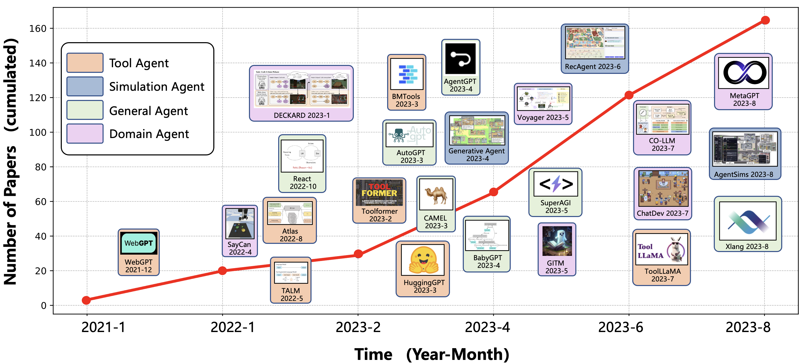
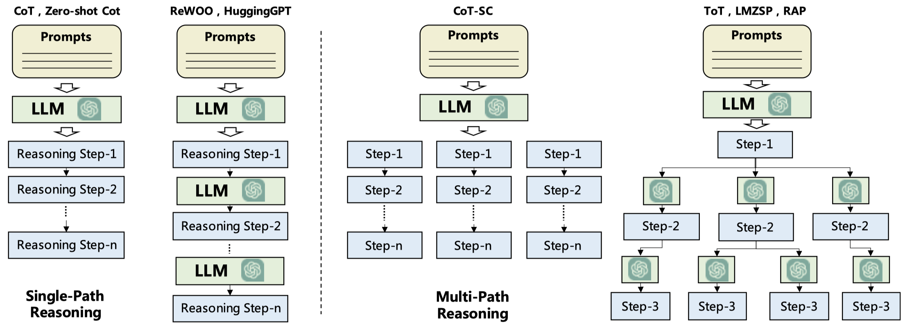
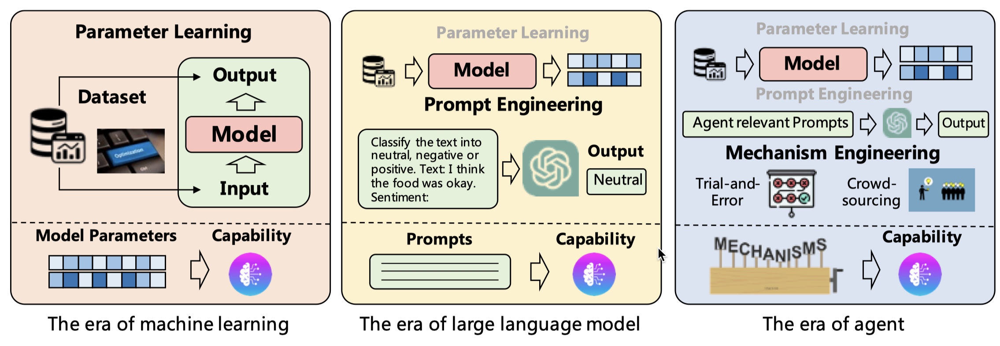
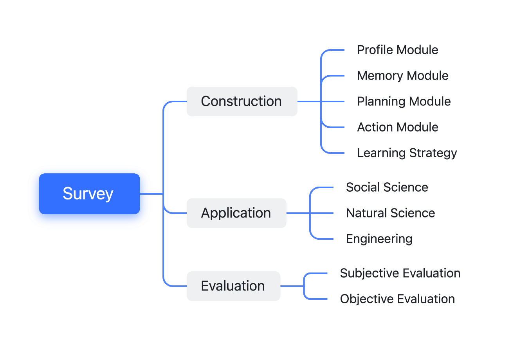
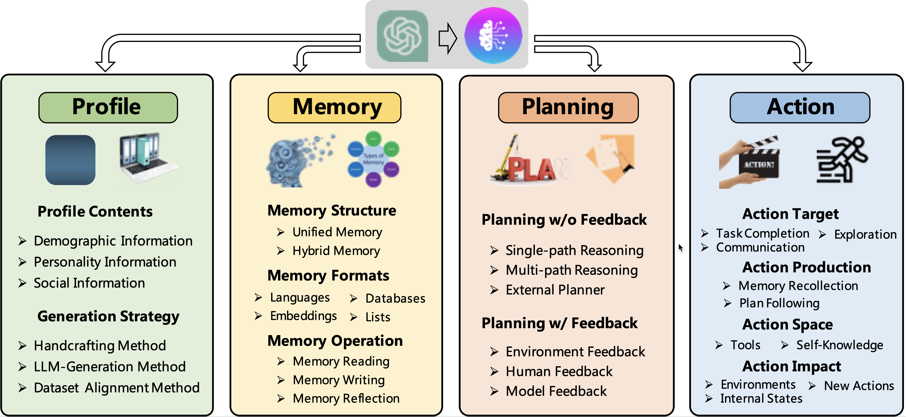
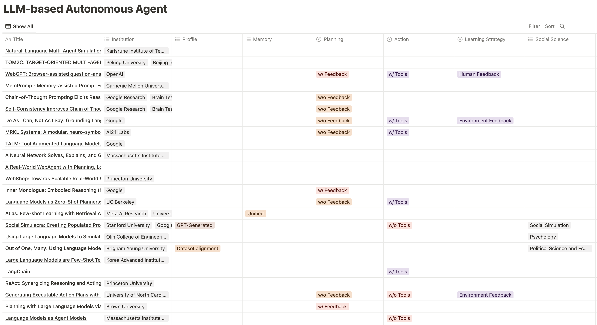

# A Survey on LLM-based Autonomous Agents



Autonomous agents are designed to achieve specific objectives through self-guided instructions. With the emergence and growth of large language models (LLMs), there is a growing trend in utilizing LLMs as fundamental controllers for these autonomous agents. While previous studies in this field have achieved remarkable successes, they remain independent proposals with little effort devoted to a systematic analysis. To bridge this gap, we conduct a comprehensive survey study, focusing on the construction, application, and evaluation of LLM-based autonomous agents. In particular, we first explore the essential components of an AI agent, including a profile module, a memory module, a planning module, and an action module. We further investigate the application of LLM-based autonomous agents in the domains of natural sciences, social sciences, and engineering. Subsequently, we delve into a discussion of the evaluation strategies employed in this field, encompassing both subjective and objective methods. Our survey aims to serve as a resource for researchers and practitioners, providing insights, related references, and continuous updates on this exciting and rapidly evolving field. 

Paper link:  [A Survey on Large Language Model based Autonomous Agents](https://arxiv.org/abs/2308.11432)


## Update Records

- 🔥 [9/8/2023] The second version of our survey has been released on arXiv.
   <details>
    <summary>Updated contents</summary>

    -  **📚 Additional References**
        - We have added 31 new works until 9/1/2023 to make the survey more comprehensive and up-to-date.

    -  **📊 New Figures**
        - **Figure 3:** This is a new figure illustrating the differences and similarities between various planning approaches. This helps in gaining a clearer understanding of the comparisons between different planning methods.
        
        - **Figure 4:** This is a new figure that describes the evolutionary path of model capability acquisition from the "Machine Learning era" to the "Large Language Model era" and then to the "Agent era." Specifically, a new concept, "mechanism engineering," has been introduced, which, along with "parameter learning" and "prompt engineering," forms part of this evolutionary path.
        

    -  **🔍 Optimized Classification System**
        - We have slightly modified the classification system in our survey to make it more logical and organized. 
  </details>

- 🔥 [8/23/2023] The first version of our survey has been released on arXiv.<br>
          

<!--omit in the toc-->
## Table of Content

<!-- - [Growth Trend in the Field of LLM-based Autonomous Agent](#-growth-trend-of-llm-based-autonomous-agent)-->
- [🤖 Construction of LLM-based Autonomous Agent](#-construction-of-llm-based-autonomous-agent)
- [📍 Applications of LLM-based Autonomous Agent](#-applications-of-llm-based-autonomous-agent)
- [📊 Evaluation on LLM-based Autonomous Agent](#-evaluation-on-llm-based-autonomous-agent)
- [🌐 More Comprehensive Summarization](#-more-comprehensive-summarization)
- [👨‍👨‍👧‍👦 Maintainers](#maintainers)
- [📚 Citation](#citation)
- [💪 How to Contribute](#how-to-contribute)
- [🫡 Acknowledgement](#acknowledgement)
- [📧 Contact Us](#contact-us)


<!-- ## 📚 Growth Trend in the Field of LLM-based Autonomous Agent

<hr>  -->

<!-- ## 📋 Structure of the Survey

<hr> -->

## 🤖 Construction of LLM-based Autonomous Agent


<table>
    <tr>
        <td rowspan='2'align='center'>Model</td>
        <td rowspan='2'align='center'>Profile</td>
        <td colspan='2'align='center'>Memory</td>
        <td rowspan='2'align='center'>Planning</td>
        <td rowspan='2'align='center'>Action</td>
        <td rowspan='2'align='center'>CA</td>  
        <td rowspan='2'align='center'>Paper</td>
        <td rowspan='2'align='center'>Code</td>
    </tr>
    <tr>
        <td align='center'>Operation</td>
        <td align='center'>Structure</td>
    </tr>
    <tr>
        <td align='center'>WebGPT</td>
        <td align='center'>-</td> 
        <td align='center'>-</td> 
        <td align='center'>-</td> 
        <td align='center'>-</td> 
        <td align='center'>w/ tools</td> 
        <td align='center'>w/ fine-tuning</td> 
        <td align='center'><a href="https://arxiv.org/abs/2112.09332">Paper</a></td>
        <td align='center'>-</td>
    </tr>
    <tr>
        <td align='center'>SayCan</td> 
        <td align='center'>-</td>  
        <td align='center'>-</td>  
        <td align='center'>-</td>  
        <td align='center'>w/o feedback</td> 
        <td align='center'>w/o tools</td> 
        <td align='center'>w/o fine-tuning</td>  
        <td align='center'><a href="https://arxiv.org/abs/2204.01691">Paper</a></td>
        <td align='center'><a href="https://say-can.github.io/">Code</a></td>
    </tr>
    <tr>
        <td align='center'>MRKL</td> 
        <td align='center'>-</td>  
        <td align='center'>-</td>  
        <td align='center'>-</td>  
        <td align='center'>w/o feedback</td> 
        <td align='center'>w/ tools</td> 
        <td align='center'>-</td>
        <td align='center'><a href="https://arxiv.org/abs/2205.00445">Paper</a></td>
        <td align='center'>-</td>
    </tr>
    <tr>
        <td align='center'>Inner Monologue</td> 
        <td align='center'>-</td>  
        <td align='center'>-</td>  
        <td align='center'>-</td>  
        <td align='center'>w/ feedback</td> 
        <td align='center'>w/o tools</td> 
        <td align='center'>w/o fine-tuning</td> 
        <td align='center'><a href="https://arxiv.org/abs/2207.05608">Paper</a></td>
        <td align='center'><a href="https://innermonologue.github.io/">Code</a></td>
    </tr>
    <tr>
        <td align='center'>Social Simulacra</td>  
        <td align='center'>GPT-Generated</td> 
        <td align='center'>-</td>  
        <td align='center'>-</td>  
        <td align='center'>-</td>  
        <td align='center'>w/o tools</td> 
        <td align='center'>-</td>   
        <td align='center'><a href="https://arxiv.org/abs/2208.04024">Paper</a></td>
        <td align='center'>-</td>
    </tr>
    <tr>
        <td align='center'>ReAct</td> 
        <td align='center'>-</td>  
        <td align='center'>-</td>  
        <td align='center'>-</td>  
        <td align='center'>w/ feedback</td> 
        <td align='center'>w/ tools</td> 
        <td align='center'>w/ fine-tuning</td> 
        <td align='center'><a href="https://arxiv.org/abs/2210.03629">Paper</a></td>
        <td align='center'><a href="https://github.com/ysymyth/ReAct">Code</a></td>
    </tr>
    <tr>
        <td align='center'>MALLM</td> 
        <td align='center'>-</td>  
        <td align='center'>Read/Write</td> 
        <td align='center'>Hybrid</td> 
        <td align='center'>-</td>  
        <td align='center'>w/o tools</td> 
        <td align='center'>-</td>   
        <td align='center'><a href="https://arxiv.org/abs/2301.04589">Paper</a></td>
        <td align='center'>-</td>
    </tr>
    <tr>
        <td align='center'>DEPS</td>  
        <td align='center'>-</td>  
        <td align='center'>-</td>  
        <td align='center'>-</td>  
        <td align='center'>w/ feedback</td> 
        <td align='center'>w/o tools</td> 
        <td align='center'>w/o fine-tuning</td> 
        <td align='center'><a href="https://arxiv.org/abs/2302.01560">Paper</a></td>
        <td align='center'><a href="https://github.com/CraftJarvis/MC-Planner">Code</a></td>
    </tr>
    <tr>
        <td align='center'>Toolformer</td> 
        <td align='center'>-</td>  
        <td align='center'>-</td>  
        <td align='center'>-</td>  
        <td align='center'>w/o feedback</td> 
        <td align='center'>w/ tools</td> 
        <td align='center'>w/ fine-tuning</td>  
        <td align='center'><a href="https://arxiv.org/abs/2302.04761">Paper</a></td>
        <td align='center'><a href="https://github.com/lucidrains/toolformer-pytorch">Code</a></td>
    </tr>
    <tr>
        <td align='center'>Reflexion</td> 
        <td align='center'>-</td>  
        <td align='center'>Read/Write/<br>Reflection</td> 
        <td align='center'>Hybrid</td> 
        <td align='center'>w/ feedback</td> 
        <td align='center'>w/o tools</td> 
        <td align='center'>w/o fine-tuning</td> 
        <td align='center'><a href="https://arxiv.org/abs/2303.11366">Paper</a></td>
        <td align='center'><a href="https://github.com/noahshinn024/reflexion">Code</a></td>
    </tr>
    <tr>
        <td align='center'>CAMEL</td> 
        <td align='center'>Handcrafting & GPT-Generated</td> 
        <td align='center'>-</td>  
        <td align='center'>-</td>  
        <td align='center'>w/ feedback</td>  
        <td align='center'>w/o tools</td> 
        <td align='center'>-</td>  
        <td align='center'><a href="https://arxiv.org/abs/2303.17660">Paper</a></td>
        <td align='center'><a href="https://github.com/camel-ai/camel">Code</a></td>
    </tr>
    <tr>
        <td align='center'>API-Bank</td> 
        <td align='center'>-</td>  
        <td align='center'>-</td>  
        <td align='center'>-</td>  
        <td align='center'>w/ feedback</td>  
        <td align='center'>w/ tools</td> 
        <td align='center'>w/o fine-tuning</td> 
        <td align='center'><a href="url">Paper</a></td>
        <td align='center'><a href="url">Code</a></td>
    </tr>
    <tr>
        <td align='center'>ViperGPT</td> 
        <td align='center'>-</td>  
        <td align='center'>-</td>  
        <td align='center'>-</td>  
        <td align='center'>-</td>  
        <td align='center'>w/ tools</td>  
        <td align='center'>-</td>  
        <td align='center'><a href="https://arxiv.org/abs/2303.08128">Paper</a></td>
        <td align='center'><a href="https://github.com/cvlab-columbia/viper">Code</a></td>
    </tr>
    <tr>
        <td align='center'>HuggingGPT</td> 
        <td align='center'>-</td>  
        <td align='center'>-</td> 
        <td align='center'>Unified</td> 
        <td align='center'>w/o feedback</td>  
        <td align='center'>w/ tools</td> 
        <td align='center'>-</td>  
        <td align='center'><a href="https://arxiv.org/abs/2303.17580">Paper</a></td>
        <td align='center'><a href="https://huggingface.co/">Code</a></td>
    </tr>
    <tr>
        <td align='center'>Generative Agents</td> 
        <td align='center'>Handcrafting</td> 
        <td align='center'>Read/Write/<br>Reflection</td> 
        <td align='center'>Hybrid</td> 
        <td align='center'>w/ feedback</td> 
        <td align='center'>w/o tools</td>  
        <td align='center'>-</td>   
        <td align='center'><a href="https://arxiv.org/abs/2304.03442">Paper</a></td>
        <td align='center'><a href="https://github.com/joonspk-research/generative_agents">Code</a></td>
    </tr>
    <tr>
        <td align='center'>LLM+P</td> 
        <td align='center'>-</td>  
        <td align='center'>-</td>  
        <td align='center'>-</td>  
        <td align='center'>w/o feedback</td> 
        <td align='center'>w/o tools</td> 
        <td align='center'>-</td>   
        <td align='center'><a href="https://arxiv.org/abs/2304.11477">Paper</a></td>
        <td align='center'>-</td>
    </tr>
    <tr>
        <td align='center'>ChemCrow</td>
        <td align='center'>-</td> 
        <td align='center'>-</td> 
        <td align='center'>-</td> 
        <td align='center'>w/ feedback</td>
        <td align='center'>w/ tools</td>
        <td align='center'>-</td> 
        <td align='center'><a href="https://arxiv.org/abs/2304.05376">Paper</a></td>
        <td align='center'><a href="https://github.com/ur-whitelab/chemcrow-public">Code</a></td>
    </tr>
    <tr>
        <td align='center'>OpenAGI</td>
        <td align='center'>-</td> 
        <td align='center'>-</td> 
        <td align='center'>-</td> 
        <td align='center'>w/ feedback</td>
        <td align='center'>w/ tools</td>
        <td align='center'>w/ fine-tuning</td>
        <td align='center'><a href="https://arxiv.org/abs/2304.04370">Paper</a></td>
        <td align='center'><a href="https://github.com/agiresearch/OpenAGI/blob/main/README.md">Code</a></td>
    </tr>
    <tr>
        <td align='center'>AutoGPT</td>
        <td align='center'>-</td> 
        <td align='center'>Read/Write</td>
        <td align='center'>Hybrid</td>
        <td align='center'>w/ feedback</td>
        <td align='center'>w/ tools</td>
        <td align='center'>w/o fine-tuning</td> 
        <td align='center'>-</td>
        <td align='center'><a href="https://github.com/Significant-Gravitas/Auto-GPT">Code</a></td>
    </tr>
    <tr>
        <td align='center'>SCM</td>
        <td align='center'>-</td> 
        <td align='center'>Read/Write</td>
        <td align='center'>Hybrid</td>
        <td align='center'>-</td> 
        <td align='center'>w/o tools</td>
        <td align='center'>-</td> 
        <td align='center'><a href="https://arxiv.org/abs/2304.13343">Paper</a></td>
        <td align='center'><a href="https://github.com/wbbeyourself/scm4llms">Code</a></td>
    </tr>
    <tr>
        <td align='center'>Socially Alignment</td>
        <td align='center'>-</td> 
        <td align='center'>Read/Write</td>
        <td align='center'>Hybrid</td>
        <td align='center'>-</td> 
        <td align='center'>w/o tools</td>
        <td align='center'>Example</td>
        <td align='center'><a href="https://arxiv.org/abs/2305.16960">Paper</a></td>
        <td align='center'><a href="https://github.com/agi-templar/Stable-Alignment">Code</a></td>
    </tr>
    <tr>
        <td align='center'>GITM</td>
        <td align='center'>-</td> 
        <td align='center'>Read/Write/<br>Reflection</td>
        <td align='center'>Hybrid</td>
        <td align='center'>w/ feedback</td> 
        <td align='center'>w/o tools</td>
        <td align='center'>w/ fine-tuning</td>
        <td align='center'><a href="https://arxiv.org/abs/2305.17144">Paper</a></td>
        <td align='center'><a href="https://github.com/OpenGVLab/GITM">Code</a></td>
    </tr>
    <tr>
        <td align='center'>Voyager</td>
        <td align='center'>-</td> 
        <td align='center'>Read/Write/<br>Reflection</td>
        <td align='center'>Hybrid</td>
        <td align='center'>w/ feedback</td> 
        <td align='center'>w/o tools</td>
        <td align='center'>w/o fine-tuning</td>
        <td align='center'><a href="https://arxiv.org/abs/2305.16291">Paper</a></td>
        <td align='center'><a href="https://github.com/MineDojo/Voyager">Code</a></td>
    </tr>
    <tr>
        <td align='center'>Introspective Tips</td>
        <td align='center'>-</td> 
        <td align='center'>-</td>
        <td align='center'>-</td>
        <td align='center'>w/ feedback</td>
        <td align='center'>w/o tools</td>
        <td align='center'>w/o fine-tuning</td>
        <td align='center'><a href="https://arxiv.org/abs/2305.11598">Paper</a></td>
        <td align='center'>-</td>
    </tr>
    <tr>
        <td align='center'>RET-LLM</td>
        <td align='center'>-</td> 
        <td align='center'>Read/Write</td>
        <td align='center'>Hybrid</td>
        <td align='center'>-</td> 
        <td align='center'>w/o tools</td>
        <td align='center'>w/ fine-tuning</td>
        <td align='center'><a href="https://arxiv.org/abs/2305.14322">Paper</a></td>
        <td align='center'>-</td>
    </tr>
    <tr>
        <td align='center'>ChatDB</td>
        <td align='center'>-</td> 
        <td align='center'>Read/Write</td> 
        <td align='center'>Hybrid</td> 
        <td align='center'>w/ feedback</td>
        <td align='center'>w/ tools</td> 
        <td align='center'>-</td> 
        <td align='center'><a href="https://arxiv.org/abs/2306.03901">Paper</a></td>
        <td align='center'>-</td>
    </tr>
    <tr>
        <td align='center'>S3</td> 
        <td align='center'>Dataset alignment</td>
        <td align='center'>Read/Write/<br>Reflection</td>
        <td align='center'>Hybrid</td> 
        <td align='center'>-</td> 
        <td align='center'>w/o tools</td>
        <td align='center'>w/ fine-tuning</td> 
        <td align='center'><a href="https://arxiv.org/abs/2307.14984">Paper</a></td>
        <td align='center'>-</td>
    </tr>
    <tr>
        <td align='center'>ChatDev</td>
        <td align='center'>Handcrafting</td>
        <td align='center'>Read/Write/<br>Reflection</td>
        <td align='center'>Hybrid</td>
        <td align='center'>w/ feedback</td>
        <td align='center'>w/o tools</td>
        <td align='center'>w/o fine-tuning</td> 
        <td align='center'><a href="https://arxiv.org/abs/2307.07924">Paper</a></td>
        <td align='center'><a href="https://github.com/OpenBMB/ChatDev">Code</a></td>
    </tr>
    <tr>
        <td align='center'>ToolLLM</td>
        <td align='center'>-</td> 
        <td align='center'>-</td> 
        <td align='center'>-</td> 
        <td align='center'>w/ feedback</td> 
        <td align='center'>w/ tools</td>
        <td align='center'>w/ fine-tuning</td>
        <td align='center'><a href="https://arxiv.org/abs/2307.16789">Paper</a></td>
        <td align='center'><a href="https://github.com/OpenBMB/ToolBench">Code</a></td>
    </tr>
    <tr>
        <td align='center'>MemoryBank</td> 
        <td align='center'>-</td> 
        <td align='center'>Read/Write/<br>Reflection</td>
        <td align='center'>Hybrid</td>
        <td align='center'>-</td> 
        <td align='center'>w/o tools</td>
        <td align='center'>-</td> 
        <td align='center'><a href="https://arxiv.org/abs/2305.10250">Paper</a></td>
        <td align='center'><a href="https://github.com/zhongwanjun/MemoryBank-SiliconFriend">Code</a></td>
    </tr>
    <tr>
        <td align='center'>MetaGPT</td>
        <td align='center'>Handcrafting</td>
        <td align='center'>Read/Write/<br>Reflection</td>
        <td align='center'>Hybrid</td>
        <td align='center'>w/ feedback</td>
        <td align='center'>w/ tools</td>
        <td align='center'>-</td>  
        <td align='center'><a href="https://arxiv.org/abs/2308.00352">Paper</a></td>
        <td align='center'><a href="https://github.com/geekan/MetaGPT">Code</a></td>
    </tr>
</table>

* More papers can be found at [More comprehensive Summarization](#more-comprehensive-summarization).
* CA means the strategy of model capability acquisition.

## 📍 Applications of LLM-based Autonomous Agent

<table>
    <tr>
        <td align='center'>Title</td>
        <td align='center'>Social Science </td>
        <td align='center'>Natural Science </td>
        <td align='center'>Engineering</td>
        <td align='center'>Paper</td>
        <td align='center'>Code</td>
    </tr>
    <tr>
        <td align='center'>Drori et al.</td>
        <td align='center'>-</td>
        <td align='center'>Science Education</td>
        <td align='center'>-</td>
        <td align='center'><a href="https://arxiv.org/abs/2112.15594">Paper</a></td>
        <td align='center'>-</td>
    </tr>
    <tr>
        <td align='center'>SayCan</td>
        <td align='center'>-</td>
        <td align='center'>-</td>
        <td align='center'>Robotics & Embodied AI</td>
        <td align='center'><a href="https://arxiv.org/pdf/2204.01691">Paper</a></td>
        <td align='center'><a href="https://say-can.github.io/">Code</a></td>
    </tr>
    <tr>
        <td align='center'>Inner monologue</td>
        <td align='center'>-</td>
        <td align='center'>-</td>
        <td align='center'>Robotics & Embodied AI</td>
        <td align='center'><a href="https://arxiv.org/pdf/2207.05608">Paper</a></td>
        <td align='center'><a href="https://innermonologue.github.io/">Code</a></td>
    </tr>
    <tr>
        <td align='center'>Language-Planners</td>
        <td align='center'>-</td>
        <td align='center'>-</td>
        <td align='center'>Robotics & Embodied AI</td>
        <td align='center'><a href="https://arxiv.org/abs/2201.07207">Paper</a></td>
        <td align='center'><a href="https://github.com/huangwl18/language-planner">Code</a></td>
    </tr>
    <tr>
        <td align='center'>Social Simulacra</td>
        <td align='center'>Social Simulation</td>
        <td align='center'>-</td>
        <td align='center'>-</td>
        <td align='center'><a href="https://arxiv.org/abs/2208.04024">Paper</a></td>
        <td align='center'>-</td>
    </tr>
    <tr>
        <td align='center'>TE</td>
        <td align='center'>Psychology </td>
        <td align='center'>-</td>
        <td align='center'>-</td>
        <td align='center'><a href="https://arxiv.org/abs/2208.10264">Paper</a></td>
        <td align='center'><a href="https://github.com/gatiaher/using-large-language-models-to-replicate-human-subject-studies">Code</a></td>
    </tr>
    <tr>
        <td align='center'>Out of One</td>
        <td align='center'>Political Science and Economy</td>
        <td align='center'>-</td>
        <td align='center'>-</td>
        <td align='center'><a href="https://arxiv.org/pdf/2209.06899">Paper</a></td>
        <td align='center'>-</td>
    </tr>
    <tr>
        <td align='center'>LIBRO</td>
        <td align='center'>CS&SE</td>
        <td align='center'>-</td>
        <td align='center'>-</td>
        <td align='center'><a href="https://arxiv.org/pdf/2209.11515">Paper</a></td>
        <td align='center'>-</td>
    </tr>
    <tr>
        <td align='center'>Blind Judgement</td>
        <td align='center'>Jurisprudence</td>
        <td align='center'>-</td>
        <td align='center'>-</td>
        <td align='center'><a href="https://arxiv.org/pdf/2301.05327.pdf">Paper</a></td>
        <td align='center'>-</td>
    </tr>
    <tr>
        <td align='center'>Horton</td>
        <td align='center'>Political Science and Economy</td>
        <td align='center'>-</td>
        <td align='center'>-</td>
        <td align='center'><a href="https://arxiv.org/abs/2301.07543">Paper</a></td>
        <td align='center'>-</td>
    </tr>
    <tr>
        <td align='center'>DECKARD</td>
        <td align='center'>-</td>
        <td align='center'>-</td>
        <td align='center'>Robotics & Embodied AI</td>
        <td align='center'><a href="https://arxiv.org/abs/2301.12050">Paper</a></td>
        <td align='center'><a href="https://github.com/DeckardAgent/deckard">Code</a></td>
    </tr>
    <tr>
        <td align='center'>Planner-Actor-Reporter</td>
        <td align='center'>-</td>
        <td align='center'>-</td>
        <td align='center'>Robotics & Embodied AI</td>
        <td align='center'><a href="https://arxiv.org/abs/2302.00763">Paper</a></td>
        <td align='center'>-</td>
    </tr>  
    <tr>
        <td align='center'>DEPS</td>
        <td align='center'>-</td>
        <td align='center'>-</td>
        <td align='center'>Robotics & Embodied AI</td>
        <td align='center'><a href="https://arxiv.org/abs/2302.01560">Paper</a></td>
        <td align='center'>-</td>
    </tr>  
    <tr>
        <td align='center'>RCI</td>
        <td align='center'>-</td>
        <td align='center'>-</td>
        <td align='center'>CS&SE</td>
        <td align='center'><a href="https://arxiv.org/abs/2303.17491">Paper</a></td>
        <td align='center'><a href="https://github.com/posgnu/rci-agent">Code</a></td>
    </tr>  
    <tr>
        <td align='center'>Generative Agents</td>
        <td align='center'>Social Simulation</td>
        <td align='center'>-</td>
        <td align='center'>-</td>
        <td align='center'><a href="https://arxiv.org/abs/2304.03442">Paper</a></td>
        <td align='center'><a href="https://github.com/joonspk-research/generative_agents">Code</a></td>
    </tr>    
    <tr>
        <td align='center'>SCG</td>
        <td align='center'>-</td>
        <td align='center'>-</td>
        <td align='center'>CS&SE</td>
        <td align='center'><a href="https://arxiv.org/pdf/2304.07590">Paper</a></td>
        <td align='center'>-</td>
    </tr>   
    <tr>
        <td align='center'>IGLU</td>
        <td align='center'>-</td>
        <td align='center'>-</td>
        <td align='center'>Civil Engineering</td>
        <td align='center'><a href="https://arxiv.org/abs/2304.10750">Paper</a></td>
        <td align='center'>-</td>
    </tr>   
    <tr>
        <td align='center'>IELLM</td>
        <td align='center'>-</td>
        <td align='center'>-</td>
        <td align='center'>Industrial Automation</td>
        <td align='center'><a href="https://arxiv.org/abs/2304.14354">Paper</a></td>
        <td align='center'>-</td>
    </tr>  
    <tr>
        <td align='center'>ChemCrow</td>
        <td align='center'>-</td>
        <td align='center'>Document and Data Management;<br>Documentation, Data Managent;<br>Science Education<br></td>
        <td align='center'>-</td>
        <td align='center'><a href="https://arxiv.org/abs/2304.05332">Paper</a></td>
        <td align='center'>-</td>
    </tr>  
    <tr>
        <td align='center'>Boiko et al.</td>
        <td align='center'>-</td>
        <td align='center'>Document and Data Management;<br>Documentation, Data Managent;<br>Science Education<br></td>
        <td align='center'>-</td>
        <td align='center'><a href="https://arxiv.org/abs/2304.14354">Paper</a></td>
        <td align='center'>-</td>
    </tr>   
    <tr>
        <td align='center'>GPT4IA</td>
        <td align='center'>-</td>
        <td align='center'>-</td>
        <td align='center'>Industrial Automation</td>
        <td align='center'><a href="https://arxiv.org/abs/2304.14721">Paper</a></td>
        <td align='center'><a href="https://github.com/YuchenXia/GPT4IndustrialAutomation">Code</a></td>
    </tr>  
    <tr>
        <td align='center'>Self-collaboration</td>
        <td align='center'>-</td>
        <td align='center'>-</td>
        <td align='center'>CS&SE</td>
        <td align='center'><a href="https://arxiv.org/abs/2304.07590">Paper</a></td>
        <td align='center'>-</td>
    </tr>   
    <tr>
        <td align='center'>E2WM</td>
        <td align='center'>-</td>
        <td align='center'>-</td>
        <td align='center'>Robotics & Embodied AI</td>
        <td align='center'><a href="https://arxiv.org/abs/2305.10626">Paper</a></td>
        <td align='center'><a href=" szxiangjn/world-model-for-language-model (github.com)">Code</a></td>
    </tr>
    <tr>
        <td align='center'>Akata et al.</td>
        <td align='center'>Psychology </td>
        <td align='center'>-</td>
        <td align='center'>-</td>
        <td align='center'><a href="https://arxiv.org/abs/2305.16867">Paper</a></td>
        <td align='center'>-</td>
    </tr>
    <tr>
        <td align='center'>Ziems et al.</td>
        <td align='center'>Psychology;<br>Political Science and Economy;<br>Research Assistant </td>
        <td align='center'>-</td>
        <td align='center'>-</td>
        <td align='center'><a href="https://arxiv.org/abs/2305.03514">Paper</a></td>
        <td align='center'>-</td>
    </tr>
    <tr>
        <td align='center'>AgentVerse</td>
        <td align='center'>Social Simulation</td>
        <td align='center'>-</td>
        <td align='center'>-</td>
        <td align='center'>-</td>
        <td align='center'><a href="https://githuba.com/OpenBMB/AgentVerse">Code</a></td>
    </tr>     
    <tr>
        <td align='center'>SmolModels</td>
        <td align='center'>-</td>
        <td align='center'>-</td>
        <td align='center'>CS&SE</td>
        <td align='center'>-</td>
        <td align='center'><a href="https://github.com/smol-ai/developer">Code</a></td>
    </tr> 
    <tr>
        <td align='center'>TidyBot</td>
        <td align='center'>-</td>
        <td align='center'>-</td>
        <td align='center'>Robotics & Embodied AI</td>
        <td align='center'><a href="https://arxiv.org/abs/2305.05658">Paper</a></td>
        <td align='center'><a href="https://github.com/jimmyyhwu/tidybot">Code</a></td>
    </tr>  
    <tr>
        <td align='center'>PET</td>
        <td align='center'>-</td>
        <td align='center'>-</td>
        <td align='center'>Robotics & Embodied AI</td>
        <td align='center'><a href="https://arxiv.org/abs/2305.02412">Paper</a></td>
        <td align='center'>-</td>
    </tr>  
    <tr>
        <td align='center'>Voyager</td>
        <td align='center'>-</td>
        <td align='center'>-</td>
        <td align='center'>Robotics & Embodied AI</td>
        <td align='center'><a href="https://arxiv.org/abs/2305.16291">Paper</a></td>
        <td align='center'><a href="https://github.com/MineDojo/Voyager">Code</a></td>
    </tr>  
    <tr>
        <td align='center'>GITM</td>
        <td align='center'>-</td>
        <td align='center'>-</td>
        <td align='center'>Robotics & Embodied AI</td>
        <td align='center'><a href="https://arxiv.org/abs/2305.17144">Paper</a></td>
        <td align='center'><a href="https://github.com/OpenGVLab/GITM">Code</a></td>
    </tr>  
    <tr>
        <td align='center'>NLSOM</td>
        <td align='center'>-</td>
        <td align='center'>Science Education</td>
        <td align='center'>-</td>
        <td align='center'><a href="https://arxiv.org/abs/2305.17066">Paper</a></td>
        <td align='center'>-</td>
    </tr>  
    <tr>
        <td align='center'>LLM4RL</td>
        <td align='center'>-</td>
        <td align='center'>-</td>
        <td align='center'>Robotics & Embodied AI</td>
        <td align='center'><a href="https://arxiv.org/abs/2306.03604">Paper</a></td>
        <td align='center'>-</td>
    </tr>  
    <tr>
        <td align='center'>GPT Engineer</td>
        <td align='center'>-</td>
        <td align='center'>-</td>
        <td align='center'>CS&SE</td>
        <td align='center'>-</td>
        <td align='center'><a href="https://github.com/AntonOsika/gpt-engineer">Code</a></td>
    </tr> 
    <tr>
        <td align='center'>Grossman et al.</td>
        <td align='center'>-</td>
        <td align='center'>Experiment Assistant;<br>Science Education</td>
        <td align='center'>-</td>
        <td align='center'><a href="https://www.science.org/doi/full/10.1126/science.adi1778">Paper</a></td>
        <td align='center'>-</td>
    </tr> 
    <tr>
        <td align='center'>SQL-PALM</td>
        <td align='center'>-</td>
        <td align='center'>-</td>
        <td align='center'>CS&SE</td>
        <td align='center'><a href="https://arxiv.org/abs/2306.00739">Paper</a></td>
        <td align='center'>-</td>
    </tr> 
    <tr>
        <td align='center'>REMEMBER</td>
        <td align='center'>-</td>
        <td align='center'>-</td>
        <td align='center'>Robotics & Embodied AI</td>
        <td align='center'><a href="https://arxiv.org/abs/2306.07929">Paper</a></td>
        <td align='center'>-</td>
    </tr> 
    <tr>
        <td align='center'>DemoGPT</td>
        <td align='center'>-</td>
        <td align='center'>-</td>
        <td align='center'>CS&SE</td>
        <td align='center'>-</td>
        <td align='center'><a href="https://github.com/melih-unsal/DemoGPT">Code</a></td>
    </tr>
    <tr>
        <td align='center'>Chatlaw</td>
        <td align='center'>Jurisprudence</td>
        <td align='center'>-</td>
        <td align='center'>-</td>
        <td align='center'><a href="https://arxiv.org/abs/2306.16092">Paper</a></td>
        <td align='center'><a href="https://github.com/PKU-YuanGroup/ChatLaw">Code</a></td>
    </tr>  
    <tr>
        <td align='center'>RestGPT</td>
        <td align='center'>-</td>
        <td align='center'>-</td>
        <td align='center'>CS&SE</td>
        <td align='center'><a href="https://arxiv.org/abs/2306.06624">Paper</a></td>
        <td align='center'><a href="https://restgpt.github.io">Code</a></td>
    </tr>
    <tr>
        <td align='center'>Dialogue shaping</td>
        <td align='center'>-</td>
        <td align='center'>-</td>
        <td align='center'>Robotics & Embodied AI</td>
        <td align='center'><a href="https://arxiv.org/abs/2307.15833">Paper</a></td>
        <td align='center'>-</td>
    </tr>  
    <tr>
        <td align='center'>TaPA</td>
        <td align='center'>-</td>
        <td align='center'>-</td>
        <td align='center'>Robotics & Embodied AI</td>
        <td align='center'><a href="https://arxiv.org/abs/2307.01848">Paper</a></td>
        <td align='center'>-</td>
    </tr>  
    <tr>
        <td align='center'>Ma et al.</td>
        <td align='center'>Psychology </td>
        <td align='center'>-</td>
        <td align='center'>-</td>
        <td align='center'><a href="https://arxiv.org/abs/2307.15810">Paper</a></td>
        <td align='center'>-</td>
    </tr>
    <tr>
        <td align='center'>Math Agents</td>
        <td align='center'>-</td>
        <td align='center'>Science Education</td>
        <td align='center'>-</td>
        <td align='center'><a href="https://arxiv.org/pdf/2307.02502">Paper</a></td>
        <td align='center'>-</td>
    </tr>  
    <tr>
        <td align='center'>SocialAI School</td>
        <td align='center'>Social Simulation</td>
        <td align='center'>-</td>
        <td align='center'>-</td>
        <td align='center'><a href="https://arxiv.org/abs/2307.07871">Paper</a></td>
        <td align='center'>-</td>
    </tr>  
    <tr>
        <td align='center'>Unified Agent</td>
        <td align='center'>-</td>
        <td align='center'>-</td>
        <td align='center'>Robotics & Embodied AI</td>
        <td align='center'><a href="https://arxiv.org/abs/2307.09668">Paper</a></td>
        <td align='center'>-</td>
    </tr>   
    <tr>
        <td align='center'>Wiliams et al.</td>
        <td align='center'>Social Simulation</td>
        <td align='center'>-</td>
        <td align='center'>-</td>
        <td align='center'><a href="https://arxiv.org/abs/2307.04986">Paper</a></td>
        <td align='center'>-</td>
    </tr> 
    <tr>
        <td align='center'>Li et al.</td>
        <td align='center'>Social Simulation</td>
        <td align='center'>-</td>
        <td align='center'>-</td>
        <td align='center'><a href="https://arxiv.org/abs/2307.10337">Paper</a></td>
        <td align='center'>-</td>
    </tr> 
    <tr>
        <td align='center'>S3</td>
        <td align='center'>Social Simulation</td>
        <td align='center'>-</td>
        <td align='center'>-</td>
        <td align='center'><a href="https://arxiv.org/abs/2307.14984">Paper</a></td>
        <td align='center'>-</td>
    </tr> 
    <tr>
        <td align='center'>Dialogue Shaping</td>
        <td align='center'>-</td>
        <td align='center'>-</td>
        <td align='center'>Robotics & Embodied AI</td>
        <td align='center'><a href="https://arxiv.org/pdf/2307.15833.pdf">Paper</a></td>
        <td align='center'>-</td>
    </tr> 
    <tr>
        <td align='center'>RoCo</td>
        <td align='center'>-</td>
        <td align='center'>-</td>
        <td align='center'>Robotics & Embodied AI</td>
        <td align='center'><a href="https://arxiv.org/abs/2307.06135">Paper</a></td>
        <td align='center'><a href="https://project-roco.github.io/">Code</a></td>
    </tr> 
    <tr>
        <td align='center'>Sayplan</td>
        <td align='center'>-</td>
        <td align='center'>-</td>
        <td align='center'>Robotics & Embodied AI</td>
        <td align='center'><a href="https://arxiv.org/abs/2307.04738">Paper</a></td>
        <td align='center'><a href="https://sayplan.github.io/">Code</a></td>
    </tr> 
    <tr>
        <td align='center'>ToolLLM</td>
        <td align='center'>-</td>
        <td align='center'>-</td>
        <td align='center'>CS&SE</td>
        <td align='center'><a href="https://arxiv.org/abs/2307.16789">Paper</a></td>
        <td align='center'><a href="https://github.com/OpenBMB/ToolBench">Code</a></td>
    </tr> 
    <tr>
        <td align='center'>ChatDEV</td>
        <td align='center'>-</td>
        <td align='center'>-</td>
        <td align='center'>CS&SE</td>
        <td align='center'><a href="https://arxiv.org/abs/2307.07924">Paper</a></td>
        <td align='center'>-</td>
    </tr> 
    <tr>
        <td align='center'>Chao et al.</td>
        <td align='center'>Social Simulation</td>
        <td align='center'>-</td>
        <td align='center'>-</td>
        <td align='center'><a href="https://arxiv.org/abs/2305.13304v1">Paper</a></td>
        <td align='center'>-</td>
    </tr>
    <tr>
        <td align='center'>AgentSims</td>
        <td align='center'>Social Simulation</td>
        <td align='center'>-</td>
        <td align='center'>-</td>
        <td align='center'><a href="https://arxiv.org/abs/2308.04026">Paper</a></td>
        <td align='center'><a href="https://github.com/py499372727/AgentSims">Code</a></td>
    </tr>
    <tr>
        <td align='center'>ChatMOF</td>
        <td align='center'>-</td>
        <td align='center'>Document and Data Management;<br>Science Education</td>
        <td align='center'>-</td>
        <td align='center'><a href="https://arxiv.org/pdf/2308.01423">Paper</a></td>
        <td align='center'>-</td>
    </tr> 
    <tr>
        <td align='center'>MetaGPT</td>
        <td align='center'>-</td>
        <td align='center'>-</td>
        <td align='center'>CS&SE</td>
        <td align='center'><a href="https://arxiv.org/abs/2308.00352">Paper</a></td>
        <td align='center'><a href="https://github.com/geekan/MetaGPT">Code</a></td>
    </tr> 
    <tr>
        <td align='center'>Codehelp</td>
        <td align='center'>-</td>
        <td align='center'>Science Education</td>
        <td align='center'>CS&SE</td>
        <td align='center'><a href="https://arxiv.org/abs/2308.06921">Paper</a></td>
        <td align='center'>-</td>
    </tr> 
    <tr>
        <td align='center'>AutoGen</td>
        <td align='center'>-</td>
        <td align='center'>Science Education</td>
        <td align='center'>-</td>
        <td align='center'><a href="https://arxiv.org/abs/2308.08155">Paper</a></td>
        <td align='center'>-</td>
    </tr>  
    <tr>
        <td align='center'>RAH</td>
        <td align='center'>-</td>
        <td align='center'>-</td>
        <td align='center'>CS&SE</td>
        <td align='center'><a href="https://arxiv.org/abs/2308.09904">Paper</a></td>
        <td align='center'>-</td>
    </tr>  
    <tr>
        <td align='center'>DB-GPT</td>
        <td align='center'>-</td>
        <td align='center'>-</td>
        <td align='center'>CS&SE</td>
        <td align='center'><a href="https://arxiv.org/abs/2308.05481">Paper</a></td>
        <td align='center'><a href="https://github.com/TsinghuaDatabaseGroup/DB-GPT">Code</a></td>
    </tr>  
    <tr>
        <td align='center'>RecMind</td>
        <td align='center'>-</td>
        <td align='center'>-</td>
        <td align='center'>CS&SE</td>
        <td align='center'><a href="https://arxiv.org/abs/2308.14296">Paper</a></td>
        <td align='center'>-</td>
    </tr>  
    <tr>
        <td align='center'>ChatEDA</td>
        <td align='center'>-</td>
        <td align='center'>-</td>
        <td align='center'>CS&SE</td>
        <td align='center'><a href="https://arxiv.org/abs/2308.10204">Paper</a></td>
        <td align='center'>-</td>
    </tr>  
    <tr>
        <td align='center'>InteRecAgent</td>
        <td align='center'>-</td>
        <td align='center'>-</td>
        <td align='center'>CS&SE</td>
        <td align='center'><a href="https://arxiv.org/abs/2308.16505">Paper</a></td>
        <td align='center'>-</td>
    </tr> 
    <tr>
        <td align='center'>PentestGPT</td>
        <td align='center'>-</td>
        <td align='center'>-</td>
        <td align='center'>CS&SE</td>
        <td align='center'><a href="https://arxiv.org/abs/2308.06782">Paper</a></td>
        <td align='center'>-</td>
    </tr> 
    <tr>
        <td align='center'>Codehelp</td>
        <td align='center'>-</td>
        <td align='center'>-</td>
        <td align='center'>CS&SE</td>
        <td align='center'><a href="https://arxiv.org/abs/2308.06921">Paper</a></td>
        <td align='center'>-</td>
    </tr>
    <tr>
        <td align='center'>ProAgent</td>
        <td align='center'>-</td>
        <td align='center'>-</td>
     	<td align='center'>Robotics & Embodied AI</td>
        <td align='center'><a href="https://arxiv.org/abs/2308.11339">Paper</a></td>
        <td align='center'>-</td>
    </tr> 
</table>

* More papers can be found at [More comprehensive Summarization](#more-comprehensive-summarization).

## 📊 Evaluation on LLM-based Autonomous Agent

<table>
    <tr>
        <td align='center'>Model</td>
        <td align='center'>Subjective </td>
        <td align='center'>Objective </td>
        <td align='center'>Benchmark</td>
        <td align='center'>Paper</td>
        <td align='center'>Code</td>
    </tr>
    <tr>
        <td align='center'>WebShop</td>
        <td align='center'>-</td>
        <td align='center'>Environment Simulation;<br> Multi-task Evaluation </td>
        <td align='center'>&check;</td>
        <td align='center'><a href="https://arxiv.org/abs/2207.01206">Paper</a></td>
        <td align='center'><a href="https://github.com/princeton-nlp/webshop">Code</a></td>
    </tr>
    <tr>
        <td align='center'>Social Simulacra</td>
        <td align='center'>Human Annotation</td>
        <td align='center'>Social Evaluation</td>
        <td align='center'>-</td>
        <td align='center'><a href="https://arxiv.org/abs/2208.04024">Paper</a></td>
        <td align='center'>-</td>
    </tr>
    <tr>
        <td align='center'>TE</td>
        <td align='center'>-</td>
        <td align='center'>Social Evaluation</td>
        <td align='center'>-</td>
        <td align='center'><a href="https://arxiv.org/abs/2208.10264">Paper</a></td>
        <td align='center'><a href="https://github.com/GatiAher/UsingLarge-Language-Models-to-Replicate-Human-Subject-Studies">Code</a></td>
    </tr>
    <tr>
        <td align='center'>LIBRO</td>
        <td align='center'>-</td>
        <td align='center'>Software Testing</td>
        <td align='center'>-</td>
        <td align='center'><a href="https://arxiv.org/abs/2209.11515">Paper</a></td>
        <td align='center'>-</td>
    </tr>
    <tr>
        <td align='center'>ReAct</td>
        <td align='center'>-</td>
        <td align='center'>Environment Simulation</td>
        <td align='center'>&check;</td>
        <td align='center'><a href="https://arxiv.org/abs/2210.03629">Paper</a></td>
        <td align='center'><a href="https://github.com/ysymyth/ReAct">Code</a></td>
    </tr>
    <tr>
        <td align='center'>Out of One, Many</td>
        <td align='center'>Turing Test</td>
        <td align='center'>Social Evaluation;<br> Multi-task Evaluation</td>
        <td align='center'>-</td>        
        <td align='center'><a href="https://arxiv.org/abs/2209.06899">Paper</a></td>
        <td align='center'>-</td>
    </tr>
    <tr>
        <td align='center'>DEPS</td>
        <td align='center'>-</td>
        <td align='center'>Environment Simulation</td>
        <td align='center'>&check;</td>
        <td align='center'><a href="https://arxiv.org/abs/2302.01560">Paper</a></td>
        <td align='center'>-</td>
    </tr>
    <tr>
        <td align='center'>Jalil et al.</td>
        <td align='center'>-</td>
        <td align='center'>Software Testing</td>
        <td align='center'>-</td>
        <td align='center'><a href="https://arxiv.org/abs/2302.03287">Paper</a></td>
        <td align='center'><a href="https://github.com/sajedjalil/ChatGPT-Software-Testing-Stud">Code</a></td>
    </tr>
    <tr>
        <td align='center'>Reflexion</td>
        <td align='center'>-</td>
        <td align='center'>Environment Simulation;<br> Multi-task Evaluation</td>
        <td align='center'>-</td>
        <td align='center'><a href="https://arxiv.org/abs/2303.11366">Paper</a></td>
        <td align='center'><a href="https://github.com/noahshinn024/reflexion">Code</a></td>
    </tr>
    <tr>
        <td align='center'>IGLU</td>
        <td align='center'>-</td>
        <td align='center'>Environment Simulation</td>
        <td align='center'>&check;</td>
        <td align='center'><a href="https://arxiv.org/abs/2304.10750">Paper</a></td>
        <td align='center'>-</td>
    </tr>
    <tr>
        <td align='center'>Generative Agents</td>
        <td align='center'> Human Annoation;<br>Turing Test</td>
        <td align='center'>-</td>
        <td align='center'>-</td>
        <td align='center'><a href="https://arxiv.org/abs/2304.03442">Paper</a></td>
        <td align='center'><a href="https://github.com/joonspk-research/generative_agents">Code</a></td>
    </tr>
    <tr>
        <td align='center'>ToolBench</td>
        <td align='center'>Human Annoation</td>
        <td align='center'>Multi-task Evalution</td>
        <td align='center'>&check;</td>
        <td align='center'><a href="https://arxiv.org/abs/2307.16789">Paper</a></td>
        <td align='center'><a href="https://github.com/OpenBMB/ToolBench">Code</a></td>
    </tr>
    <tr>
        <td align='center'>GITM</td>
        <td align='center'>-</td>
        <td align='center'>Environment Simulation</td>
        <td align='center'>&check;</td>
        <td align='center'><a href="https://arxiv.org/abs/2305.17144">Paper</a></td>
        <td align='center'><a href="https://github.com/OpenGVLab/GITM">Code</a></td>
    </tr>
    <tr>
        <td align='center'>Two-Failures</td>
        <td align='center'>-</td>
        <td align='center'>Multi-task Evalution</td>
        <td align='center'>-</td>
        <td align='center'><a href="https://arxiv.org/abs/2305.14279">Paper</a></td>
        <td align='center'>-</td>
    </tr>
    <tr>
        <td align='center'>Voyager</td>
        <td align='center'>-</td>
        <td align='center'>Environment Simulation</td>
        <td align='center'>&check;</td>
        <td align='center'><a href="https://arxiv.org/abs/2305.16291">Paper</a></td>
        <td align='center'><a href="https://github.com/MineDojo/Voyager">Code</a></td>
    </tr>
    <tr>
        <td align='center'>SocKET</td>
        <td align='center'>-</td>
        <td align='center'>Social Evaluation;<br>Multi-task Evaluation </td>
        <td align='center'>&check;</td>
        <td align='center'><a href="https://arxiv.org/abs/2305.14938">Paper</a></td>
        <td align='center'>-</td>
    </tr>
    <tr>
        <td align='center'>Mobile-Env</td>
        <td align='center'>-</td>
        <td align='center'>Environment Simulation;<br> Multi-task Evaluation</td>
        <td align='center'>&check;</td>
        <td align='center'><a href="https://arxiv.org/abs/2305.08144">Paper</a></td>
        <td align='center'><a href="https://github.com/X-LANCE/Mobile-Env">Code</a></td>
    </tr>
    <tr>
        <td align='center'>Clembench</td>
        <td align='center'>-</td>
        <td align='center'>Environment Simulation;<br> Multi-task Evaluation</td>
        <td align='center'>&check;</td>
        <td align='center'><a href="https://arxiv.org/abs/2305.13455">Paper</a></td>
        <td align='center'><a href="https://github.com/clp-research/clembench">Code</a></td>
    </tr>
    <tr>
        <td align='center'>Dialop</td>
        <td align='center'>-</td>
        <td align='center'>Social Evaluation</td>
        <td align='center'>&check;</td>
        <td align='center'><a href="https://arxiv.org/abs/2305.20076">Paper</a></td>
        <td align='center'><a href="https://github.com/jlin816/dialop">Code</a></td>
    </tr>
    <tr>
        <td align='center'>Feldt et al.</td>
        <td align='center'>-</td>
        <td align='center'>Software Testing</td>
        <td align='center'>-</td>
        <td align='center'><a href="https://arxiv.org/abs/2306.05152">Paper</a></td>
        <td align='center'>-</td>
    </tr>
    <tr>
        <td align='center'>CO-LLM</td>
        <td align='center'>Human Annoation</td>
        <td align='center'>Environment Simulation</td>
        <td align='center'>-</td>
        <td align='center'><a href="https://arxiv.org/abs/2307.02485">Paper</a></td>
        <td align='center'><a href="https://vis-www.cs.umass.edu/Co-LLM-Agents/">Code</a></td>
    </tr>
    <tr>
        <td align='center'>Tachikuma</td>
        <td align='center'>Human Annoation</td>
        <td align='center'>Environment Simulation</td>
        <td align='center'>&check;</td>
        <td align='center'><a href="https://arxiv.org/abs/2307.12573">Paper</a></td>
        <td align='center'>-</td>
    </tr>
    <tr>
        <td align='center'>WebArena</td>
        <td align='center'>-</td>
        <td align='center'>Environment Simulation</td>
        <td align='center'>&check;</td>
        <td align='center'><a href="https://arxiv.org/abs/2307.13854">Paper</a></td>
        <td align='center'><a href="https://github.com/web-arena-x/webarena">Code</a></td>
    </tr>
    <tr>
        <td align='center'>RocoBench</td>
        <td align='center'>-</td>
        <td align='center'>Environment Simulation;<br> Social Evaluation;<br> Multi-task Evaluation</td>
        <td align='center'>&check;</td>
        <td align='center'><a href="https://arxiv.org/abs/2307.04738">Paper</a></td>
        <td align='center'><a href="https://project-roco.github.io/">Code</a></td>
    </tr>
    <tr>
        <td align='center'>AgentSims</td>
        <td align='center'>-</td>
        <td align='center'>Social Evaluation</td>
        <td align='center'>-</td>
        <td align='center'><a href="https://arxiv.org/abs/2308.04026">Paper</a></td>
        <td align='center'><a href="https://github.com/py499372727/AgentSims">Code</a></td>
    </tr>
    <tr>
        <td align='center'>AgentBench</td>
        <td align='center'>-</td>
        <td align='center'>Multi-task Evaluation</td>
        <td align='center'>&check;</td>
        <td align='center'><a href="https://arxiv.org/abs/2308.03688">Paper</a></td>
        <td align='center'><a href="https://github.com/thudm/agentbench">Code</a></td>
    </tr>
    <tr>
        <td align='center'>BOLAA</td>
        <td align='center'>-</td>
        <td align='center'>Environment Simulation;<br>Multi-task Evaluation;<br>Software Testing</td>
        <td align='center'>&check;</td>
        <td align='center'><a href="https://arxiv.org/abs/2308.05960">Paper</a></td>
        <td align='center'><a href="https://github.com/salesforce/BOLAA">Code</a></td>
    </tr>
    <tr>
        <td align='center'>Gentopia</td>
        <td align='center'>-</td>
        <td align='center'>Isolated Reasoning;<br> Multi-task Evaluation </td>
        <td align='center'>&check;</td>
        <td align='center'><a href="https://arxiv.org/abs/2308.04030">Paper</a></td>
        <td align='center'><a href="https://github.com/Gentopia-AI/Gentopia">Code</a></td>
    </tr>
    <tr>
        <td align='center'>EmotionBench</td>
        <td align='center'>Human Annotation</td>
        <td align='center'>-</td>
        <td align='center'>&check;</td>
        <td align='center'><a href="https://arxiv.org/abs/2308.03656">Paper</a></td>
        <td align='center'><a href="https://github.com/CUHK-ARISE/EmotionBench">Code</a></td>
    </tr>
    <tr>
        <td align='center'>PTB</td>
        <td align='center'>-</td>
        <td align='center'>Software Testing </td>
        <td align='center'>&check;</td>
        <td align='center'><a href="https://arxiv.org/abs/2308.06782">Paper</a></td>
        <td align='center'>-</td>
    </tr>
</table>

* More papers can be found at [More comprehensive Summarization](#more-comprehensive-summarization).

<hr>

## 🌐 More Comprehensive Summarization

We are maintaining an [interactive table](https://abyssinian-molybdenum-f76.notion.site/237e9f7515d543c0922c74f4c3012a77?v=0a309e53d6454afcbe7a5a7e169be0f9&pvs=4) that contains more comprehensive papers related to LLM-based Agents. This table includes details such as tags, authors, publication date, and more, allowing you to sort, filter, and find the papers of interest to you.


## 👨‍👨‍👧‍👦 Maintainers
- Lei Wang@[Paitesanshi](https://github.com/Paitesanshi)
- Chen Ma@[Uily](https://github.com/Yilu114)
- Xueyang Feng@[XueyangFeng](https://github.com/XueyangFeng)

## 📚 Citation
If you find this survey useful, please cite our paper:
```
@misc{wang2023survey,
      title={A Survey on Large Language Model based Autonomous Agents}, 
      author={Lei Wang and Chen Ma and Xueyang Feng and Zeyu Zhang and Hao Yang and Jingsen Zhang and Zhiyuan Chen and Jiakai Tang and Xu Chen and Yankai Lin and Wayne Xin Zhao and Zhewei Wei and Ji-Rong Wen},
      year={2023},
      eprint={2308.11432},
      archivePrefix={arXiv},
      primaryClass={cs.AI}
}
```


## 💪 How to Contribute
If you have a paper or are aware of relevant research that should be incorporated, please contribute via pull requests, issues, email, or other suitable methods.


## 🫡 Acknowledgement
We thank the following people for their valuable suggestions and contributions to this survey:
- Yifan Song[@Yifan-Song793](https://github.com/Yifan-Song793)
- Qichen Zhao[@Andrewzh112](https://github.com/Andrewzh112)
- Ikko E. Ashimine[@eltociear](https://github.com/eltociear)


## 📧 Contact Us
If you have any questions or suggestions, please contact us via:
- Email: wanglei154@ruc.edu.cn, xu.chen@ruc.edu.cn


